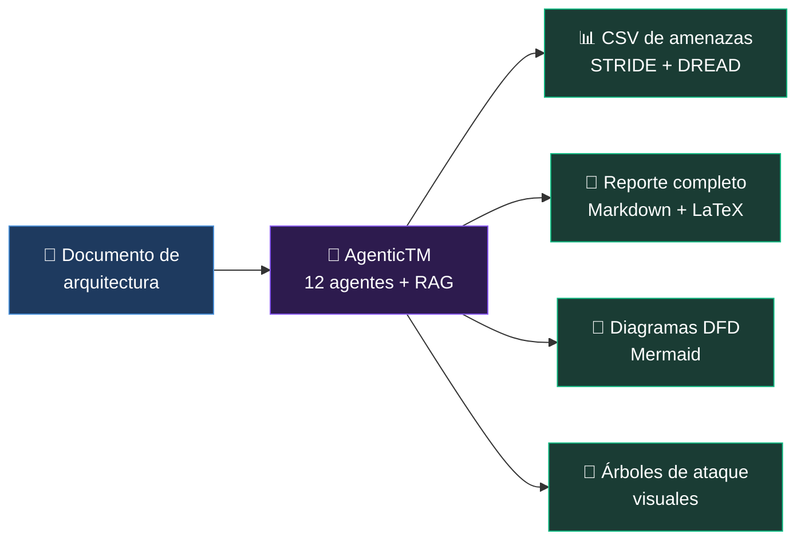
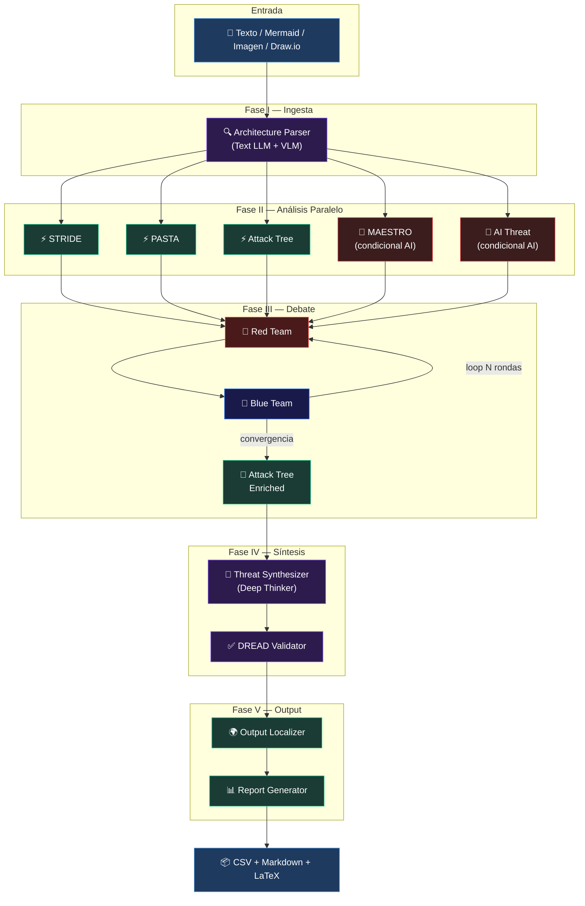

# 01 — Introducción y Visión

> *"Lo mejor de todos los mundos"* — Un analista experto por cada metodología de threat modeling,
> debatiendo entre sí para producir un resultado más completo que cualquier enfoque individual.

---

## ¿Qué es AgenticTM?

**AgenticTM** (Agentic Threat Modeler) es un sistema multi-agente de threat modeling que orquesta **12 agentes especializados** de inteligencia artificial para analizar la arquitectura de un sistema de software y producir un modelo de amenazas profesional.

A diferencia de las herramientas tradicionales que dependen de un solo modelo o un checklist estático, AgenticTM despliega un **equipo virtual de expertos en seguridad**: cada agente domina una metodología específica (STRIDE, PASTA, Attack Trees, MAESTRO, OWASP AI), y después un **debate adversarial** (Red Team vs Blue Team) valida, escala y refina las amenazas encontradas.

El resultado es un **Threat Model completo** con:
- CSV de amenazas con scoring DREAD (compatible con plantillas organizacionales)
- Reporte Markdown con resumen ejecutivo, DFD, tablas detalladas y debate
- Reporte LaTeX profesional listo para compilar
- Diagramas DFD en Mermaid
- Árboles de ataque visuales

---

## Origen e Inspiración

AgenticTM nace de la convergencia de tres líneas de trabajo:

### 1. Necesidad Operativa
El equipo de AppSec realizaba threat models manuales que consumían **3-5 días por sistema**. Con docenas de proyectos en pipeline, la carga operativa era insostenible. Se necesitaba una herramienta que transformara a AppSec de "operador" a "habilitador" — manteniendo la profundidad de análisis pero reduciendo el tiempo a **minutos**.

### 2. Investigación Académica
Múltiples papers recientes demuestran que los LLMs pueden identificar amenazas de seguridad con cobertura comparable a analistas humanos, especialmente cuando se combinan con RAG (Retrieval-Augmented Generation) y frameworks estructurados como STRIDE y PASTA.

### 3. Arquitectura TradingAgents
El diseño del pipeline se inspira directamente en [TradingAgents v0.4.0](https://github.com/TradingAgents), un sistema multi-agente para análisis financiero que utiliza:
- **Fan-out paralelo** de analistas especializados
- **Debate adversarial** (Bull vs Bear → Red vs Blue)
- **Patrón Quick/Deep Thinker** (modelos rápidos para triage, modelos profundos para síntesis)
- **Orquestación LangGraph** con estado compartido tipado

AgenticTM adapta esta arquitectura: analistas financieros → analistas de seguridad, Bull/Bear → Red/Blue Team, Research Manager → Threat Synthesizer.

---

## ¿Qué Problema Resuelve?



| Problema | Cómo lo resuelve AgenticTM |
|----------|---------------------------|
| TM manual toma 3-5 días | Pipeline completo en 15-45 minutos |
| Un solo analista = una sola perspectiva | 5 metodologías diferentes en paralelo |
| Sin cobertura de amenazas AI/LLM | Agentes especializados en MAESTRO, OWASP AI, PLOT4ai, Agent Protocol Security |
| Inconsistencia entre TMs | RAG con TMs previos como few-shot examples |
| Sin debate/validación cruzada | Red Team vs Blue Team adversarial |
| Output no aprovechable | CSV compatible con templates organizacionales, reporte en Markdown/LaTeX |
| Requiere GPU cloud costosa | Corre 100% local con Ollama (16-32 GB RAM) |

---

## Diferenciadores Clave

### 🏗️ Multi-Metodología Simultánea
No usa solo STRIDE ni solo PASTA — ejecuta **5 metodologías en paralelo** y después sintetiza lo mejor de cada una. Esto produce una cobertura de amenazas significativamente mayor que cualquier enfoque individual.

### 🎭 Debate Adversarial
Después del análisis, un Red Team (atacante) debate contra un Blue Team (defensor) durante N rondas. El Red Team escala amenazas y propone ataques compuestos; el Blue Team evalúa controles existentes y propone mitigaciones. Este debate converge cuando no se encuentran vectores nuevos (`[CONVERGENCIA]`).

### 📚 RAG con Knowledge Base Dual
El sistema combina **búsqueda vectorial** (ChromaDB) con **navegación estructural** (PageIndex trees) para consultar libros de seguridad, papers de investigación, bases de riesgos/mitigaciones, threat models previos y amenazas de AI — todo indexado localmente.

### 🖥️ 100% Local
Todo el procesamiento ocurre en la máquina del usuario vía **Ollama**. Ningún dato sale del entorno local. Esto es crítico para organizaciones con requisitos de soberanía de datos.

### 🔬 Condicional e Inteligente
Los agentes MAESTRO y AI Threat solo se activan si el sistema analizado contiene componentes de AI/ML (detección por keywords). Esto evita falsos positivos innecesarios en sistemas puramente tradicionales.

---

## Requisitos de Sistema

### Hardware Mínimo

| Recurso | Mínimo | Recomendado |
|---------|--------|-------------|
| **RAM** | 16 GB | 32 GB |
| **VRAM (GPU)** | 8 GB | 16+ GB |
| **Disco** | 20 GB libres | 50+ GB (para modelos Ollama) |
| **CPU** | 8 cores | 16+ cores |

### Software

| Componente | Versión |
|------------|---------|
| Python | ≥ 3.11 (recomendado 3.13) |
| Ollama | Latest |
| Git | Latest |
| Docker (opcional) | 24+ con Compose v2 |

### Modelos Ollama Requeridos

```bash
# Modelos que necesitás descargar
ollama pull qwen3.5:4b         # ~3.4 GB — Quick Thinker (analistas rápidos)
ollama pull qwen3.5:9b         # ~6.6 GB — STRIDE/Debate + VLM (multimodal nativo)
ollama pull qwen3.5:27b        # ~17 GB — Deep Thinker (síntesis, análisis profundo)
ollama pull nomic-embed-text   # ~274 MB — Embeddings para RAG
```

> ⚠️ **Nota sobre VRAM**: Con `max_parallel_analysts: 2` (default), el sistema carga como máximo 2 modelos de análisis simultáneamente. En una GPU de 16 GB, esto funciona bien con `qwen3.5:4b` (~3.4 GB cada uno). Todos los modelos Qwen3.5 soportan **contexto de 256K** e **input multimodal nativo** (texto + imágenes), por lo que no se necesita un modelo de visión separado.

---

## Arquitectura de Alto Nivel



---

## Inspiración Académica y Práctica

Los frameworks y fuentes académicas que alimentan a AgenticTM incluyen:

| Framework | Uso en AgenticTM | Agente(s) |
|-----------|------------------|-----------|
| **STRIDE** (Microsoft, 1999) | Análisis por elemento del sistema | STRIDE Analyst |
| **PASTA** (VerSprite, 2012) | Análisis orientado a riesgo de negocio | PASTA Analyst |
| **Attack Trees** (Schneier, 1999) | Modelado jerárquico de ataques | Attack Tree Analyst |
| **DREAD** (Microsoft, 2002) | Scoring cuantitativo de riesgo | DREAD Validator + Synthesizer |
| **MAESTRO** (CSA, 2024) | Modelo de 7 capas para amenazas AI | MAESTRO Analyst |
| **OWASP Top 10 LLM** (2025) | Vulnerabilidades específicas de LLM | AI Threat Analyst |
| **OWASP Agentic AI Top 10** (2026) | Vulnerabilidades de sistemas agénticos | AI Threat Analyst |
| **PLOT4ai** (2023) | 8 categorías de riesgo AI/ML | AI Threat Analyst (via RAG) |
| **AI Agent Protocol Security** (CIC/UNB, 2026) | 32 amenazas de protocolos MCP/A2A/Agora/ANP | AI Threat Analyst |
| **NIST SP 800-53** | Controles de seguridad recomendados | Synthesizer (mitigaciones) |
| **MITRE ATT&CK** | Técnicas de ataque referenciadas | STRIDE + PASTA + Debate |
| **CAPEC / CWE** | Patrones de ataque y weaknesses | Todos los analistas (via RAG) |

> Para un análisis detallado de cada framework, ver [02 — Fundamentos Académicos](02_fundamentos_academicos.md).

---

## Estado Actual del Proyecto

| Aspecto | Estado | Detalle |
|---------|--------|---------|
| Pipeline multi-agente | ✅ Funcional | 13 nodos, 6 fases, modos hybrid/cascade/parallel |
| RAG dual | ✅ Funcional | ChromaDB + PageIndex trees, 5 stores |
| API REST | ✅ Funcional | 28+ endpoints, SSE streaming |
| Frontend SPA | ✅ Funcional | Dark theme, 7 tabs, Mermaid rendering |
| Docker | ✅ Funcional | Dockerfile + docker-compose con Ollama |
| CI/CD | ✅ Funcional | GitHub Actions (lint + test + docker) |
| Tests | ⚠️ Básico | 54 tests unitarios, sin e2e |
| Autenticación | ⚠️ MVP | API key simple (sin RBAC) |
| Seguridad API | ⚠️ MVP | Sin rate limiting, validación básica |
| Documentación | 📝 En progreso | Este documento |

> Para el roadmap completo de mejoras pendientes, ver [11 — Mejoras y Roadmap](11_mejoras_roadmap.md).

---

*[← Índice](00_indice.md) · [02 — Fundamentos Académicos →](02_fundamentos_academicos.md)*
