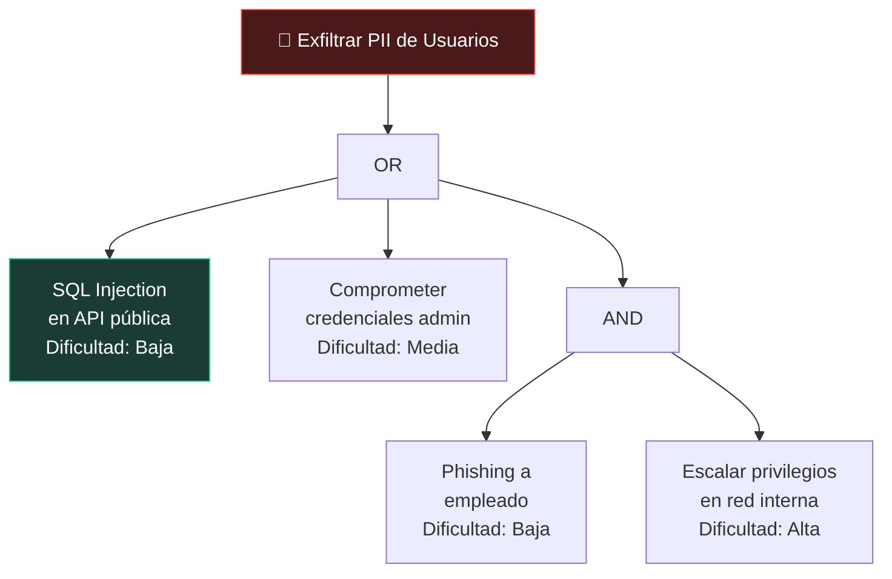

# 02 — Fundamentos Académicos

> Los frameworks y papers de investigación que alimentan la inteligencia de AgenticTM.

---

## Panorama

AgenticTM no implementa una sola metodología — integra **6 frameworks de threat modeling**, **4 taxonomías de amenazas AI**, y **3 bases de datos de ataque** en un pipeline unificado. Cada agente especializado domina una porción de este corpus, y el Threat Synthesizer consolida todo en un modelo de amenazas cohesivo.

```mermaid
graph TB
    subgraph "Frameworks Clásicos"
        STRIDE["STRIDE<br/>(Microsoft, 1999)"]
        PASTA["PASTA<br/>(VerSprite, 2012)"]
        ATREE["Attack Trees<br/>(Schneier, 1999)"]
        DREAD["DREAD<br/>(Microsoft, 2002)"]
    end

    subgraph "Frameworks AI/Agénticos"
        MAESTRO["MAESTRO 7-Layer<br/>(CSA, 2024)"]
        OWASP_LLM["OWASP Top 10 LLM<br/>(2025)"]
        OWASP_AGE["OWASP Agentic AI<br/>Top 10 (2026)"]
        PLOT4AI["PLOT4ai<br/>(2023)"]
        PROTO["Agent Protocol Security<br/>(CIC/UNB, 2026)"]
    end

    subgraph "Bases de Datos"
        CAPEC["CAPEC<br/>(MITRE)"]
        CWE["CWE<br/>(MITRE)"]
        ATT["MITRE ATT&CK"]
        NIST["NIST SP 800-53"]
    end

    STRIDE --> SYN["🎯 Threat Synthesizer"]
    PASTA --> SYN
    ATREE --> SYN
    MAESTRO --> SYN
    OWASP_LLM --> SYN
    OWASP_AGE --> SYN
    PLOT4AI --> SYN
    PROTO --> SYN
    DREAD --> SYN
    CAPEC -.-> SYN
    CWE -.-> SYN
    ATT -.-> SYN
    NIST -.-> SYN
```



---

## STRIDE (Microsoft, 1999)

### Concepto

STRIDE es un modelo de clasificación de amenazas desarrollado por Loren Kohnfelder y Praerit Garg en Microsoft. El acrónimo representa seis categorías de amenazas:

| Categoría | Propiedad Violada | Descripción |
|-----------|-------------------|-------------|
| **S**poofing | Autenticación | Suplantar la identidad de otro componente o usuario |
| **T**ampering | Integridad | Modificar datos en tránsito o en reposo sin autorización |
| **R**epudiation | No-repudio | Negar haber realizado una acción sin poder ser refutado |
| **I**nformation Disclosure | Confidencialidad | Exponer información a actores no autorizados |
| **D**enial of Service | Disponibilidad | Degradar o interrumpir el servicio |
| **E**levation of Privilege | Autorización | Obtener permisos superiores a los asignados |

### Implementación en AgenticTM

El **STRIDE Analyst** (`stride_analyst.py`) aplica **STRIDE-per-element**: examina cada componente, flujo de datos y boundary del sistema, y evalúa cuál de las 6 categorías aplica. Usa el tier `stride_json` (Qwen3.5:9b por defecto) para producir un análisis estructurado con razonamiento detallado.

```python
# Ejemplo de output del STRIDE Analyst
{
    "methodology": "STRIDE",
    "threats": [
        {
            "component": "API Gateway",
            "stride_category": "S",  # Spoofing
            "description": "Un atacante podría forjar tokens JWT...",
            "impact": "High",
            "references": "CAPEC-94, CWE-287, ATT&CK T1078",
            "confidence_score": 0.85
        }
    ]
}
```

### Referencias Académicas
- Shostack, A. (2014). *Threat Modeling: Designing for Security*. Wiley.
- Kohnfelder, L. & Garg, P. (1999). *The Threats to our Products*. Microsoft internal memo.

---

## PASTA — Process for Attack Simulation and Threat Analysis (VerSprite, 2012)

### Concepto

PASTA es una metodología de threat modeling centrada en el **riesgo de negocio**, con 7 etapas que progresan desde la definición de objetivos hasta la simulación de ataques:

| Etapa | Nombre | Propósito |
|-------|--------|-----------|
| 1 | Definición de Objetivos | Establecer el contexto de negocio y compliance |
| 2 | Definición del Alcance Técnico | Inventariar componentes y tecnologías |
| 3 | Descomposición de la Aplicación | Mapear DFDs, trust boundaries, entry points |
| 4 | Análisis de Amenazas | Identificar escenarios de ataque basados en intelligence |
| 5 | Análisis de Vulnerabilidades | Mapear CVEs, CWEs y debilidades conocidas |
| 6 | Modelado de Ataques | Simular ataques y construir árboles de ataque |
| 7 | Análisis de Riesgo e Impacto | Cuantificar riesgo y priorizar remediación |

### Implementación en AgenticTM

El **PASTA Analyst** (`pasta_analyst.py`) condensa las 7 etapas en una sola invocación LLM que produce "narrativas de ataque" — historias detalladas de 3-5 oraciones que describen cómo un atacante explotaría una vulnerabilidad específica.

```python
# Ejemplo de output del PASTA Analyst
{
    "methodology": "PASTA",
    "business_context": "Sistema financiero multi-tenant con datos PCI-DSS...",
    "threats": [
        {
            "attack_scenario": "Un atacante con credenciales de merchant...",
            "target_asset": "Ledger de transacciones",
            "attack_path": ["1. Obtener acceso...", "2. Explotar...", "3. Exfiltrar..."],
            "risk_level": "High",
            "vulnerabilities_exploited": "CWE-863, CVE-2024-XXXX"
        }
    ]
}
```

### Diferencia con STRIDE
Mientras STRIDE clasifica por **tipo de amenaza** (categoría abstracta), PASTA clasifica por **escenario de ataque** (narrativa concreta orientada al negocio). AgenticTM usa ambas perspectivas para maximizar cobertura.

### Referencias
- UcedaVélez, T. & Morana, M. (2015). *Risk Centric Threat Modeling*. Wiley.

---

## Attack Trees (Schneier, 1999)

### Concepto

Un Attack Tree es una estructura jerárquica donde:
- **Raíz**: Objetivo del atacante (e.g., "Exfiltrar datos financieros")
- **Nodos intermedios**: Sub-objetivos con operadores AND/OR
- **Hojas**: Acciones concretas del atacante con dificultad/costo asociado

El **cheapest path** (camino más barato) es el conjunto de acciones con menor dificultad total que logra el objetivo raíz.

### Implementación en AgenticTM

El **Attack Tree Analyst** tiene **dos pasadas**:

1. **Fase II (inicial)**: Analiza la arquitectura y genera 3-5 árboles con los principales objetivos de un atacante. Output en Mermaid `graph TD`.

2. **Fase II.5 (enriched)**: Post-debate, con acceso a TODOS los outputs previos (STRIDE, PASTA, MAESTRO, AI Threats, debate Red/Blue), genera 5-7 árboles enriquecidos con cross-references.



### Referencias
- Schneier, B. (1999). *Attack Trees*. Dr. Dobb's Journal.
- Mauw, S. & Oostdijk, M. (2005). *Foundations of Attack Trees*. ISSA.

---

## DREAD (Microsoft, 2002)

### Concepto

DREAD es un sistema de scoring cuantitativo para priorizar amenazas. Cada dimensión se puntúa de 0 a 10:

| Dimensión | Pregunta |
|-----------|----------|
| **D**amage | ¿Qué tan grave es el impacto si se explota? |
| **R**eproducibility | ¿Qué tan fácil es reproducir el ataque? |
| **E**xploitability | ¿Qué tan fácil es ejecutar el ataque? |
| **A**ffected Users | ¿Cuántos usuarios se ven impactados? |
| **D**iscoverability | ¿Qué tan fácil es descubrir la vulnerabilidad? |

El **total DREAD** (0-50) determina la prioridad:

| Rango | Prioridad |
|-------|-----------|
| 40-50 | 🔴 Critical |
| 25-39 | 🟠 High |
| 11-24 | 🟡 Medium |
| 1-10 | 🟢 Low |

### Implementación en AgenticTM

El scoring DREAD se asigna en **dos etapas**:

1. **Threat Synthesizer**: Asigna scores iniciales basándose en todas las metodologías + debate.
2. **DREAD Validator**: Valida y corrige scores contra la arquitectura real. Tiene un **guardrail del 80%**: si el validador devuelve menos del 80% de las amenazas originales, se realiza un merge preservando las amenazas faltantes con sus scores originales.

### Fórmula

$$\text{DREAD Total} = D + R + E + A + D$$

$$\text{Priority} = \begin{cases} \text{Critical} & \text{si } \text{DREAD} \geq 40 \\ \text{High} & \text{si } 25 \leq \text{DREAD} < 40 \\ \text{Medium} & \text{si } 11 \leq \text{DREAD} < 25 \\ \text{Low} & \text{si } \text{DREAD} < 11 \end{cases}$$

### Notas
DREAD fue oficialmente descontinuado por Microsoft en 2008 por considerarlo subjetivo. Sin embargo, sigue siendo ampliamente usado en la industria, y el doble scoring (Synthesizer + Validator) de AgenticTM mitiga parcialmente la subjetividad.

---

## MAESTRO — Multi-Agent Environment for Security Threat Risk Observations (CSA, 2024)

### Concepto

MAESTRO es un framework de la Cloud Security Alliance (CSA) diseñado específicamente para modelar amenazas en **sistemas de AI/ML agenticos**. Define 7 capas de análisis:

| Capa | Nombre | Foco |
|------|--------|------|
| L1 | Foundation Models | Vulnerabilidades del modelo base (poisoning, jailbreak, hallucination) |
| L2 | Data Operations | Pipeline de datos (ingestion, preprocessing, storage, quality) |
| L3 | Agent Frameworks | Frameworks como LangChain, AutoGPT, CrewAI (prompt injection, tool misuse) |
| L4 | Deployment & Infrastructure | Contenedores, orquestación, GPU sharing, model serving |
| L5 | Tool & API Integration | APIs externas, MCP servers, function calling, credential management |
| L6 | Agent-to-Agent Communication | Multi-agent protocols, trust, message tampering, authority spoofing |
| L7 | Ecosystem & Governance | Compliance, audit trails, model versioning, human oversight |

### Implementación en AgenticTM

El **MAESTRO Analyst** (`maestro_analyst.py`) se activa **condicionalmente** — solo cuando detecta ≥30 keywords de AI en el input del sistema. Combina MAESTRO con OWASP Agentic Applications Top 10 (ASI01-ASI10).

```python
# Activación condicional
AI_KEYWORDS = ["ai", "ml", "llm", "model", "agent", "agentic", "rag", 
               "embedding", "neural", "prompt", "langchain", ...]

def _has_ai_components(state) -> bool:
    # Busca keywords en description + components + raw_input + reports
    return any(kw in combined_text.lower() for kw in AI_KEYWORDS)
```

### Referencias
- Cloud Security Alliance (2024). *MAESTRO: A Framework for Analyzing Multi-Agent AI Systems*.

---

## OWASP Top 10 para LLM Applications (2025)

### Catálogo de Vulnerabilidades

| ID | Vulnerable | Descripción |
|----|-----------|-------------|
| LLM01 | Prompt Injection | Inyección de instrucciones maliciosas en prompts |
| LLM02 | Sensitive Information Disclosure | Filtración de datos de entrenamiento o contexto |
| LLM03 | Supply Chain Vulnerabilities | Dependencias comprometidas en frameworks AI |
| LLM04 | Data and Model Poisoning | Envenenamiento de datos de entrenamiento |
| LLM05 | Improper Output Handling | Outputs no sanitizados que causan XSS/injection |
| LLM06 | Excessive Agency | Modelo con permisos excesivos sobre herramientas |
| LLM07 | System Prompt Leakage | Extracción del system prompt por el usuario |
| LLM08 | Vector and Embedding Weaknesses | Ataques a la capa de embeddings y vector stores |
| LLM09 | Misinformation | Hallucinations que generan impacto de negocio |
| LLM10 | Unbounded Consumption | DoS por consumo descontrolado de recursos |

### Implementación
El **AI Threat Analyst** referencia LLM01-LLM10 directamente en su prompt para clasificar amenazas específicas de LLM.

### Referencias
- OWASP Foundation (2025). *OWASP Top 10 for LLM Applications v2025*.

---

## OWASP Agentic AI Top 10 (2026)

### Catálogo

| ID | Vulnerabilidad | Descripción |
|----|---------------|-------------|
| ASI01 | Prompt Injection (Agentic) | Inyección en contexto multi-agente |
| ASI02 | Sensitive Info Disclosure | Filtración cross-agent |
| ASI03 | Supply Chain | Dependencias de tools/plugins comprometidas |
| ASI04 | Excessive Agency | Agente con herramientas sin guardrails |
| ASI05 | Insecure Output Handling | Outputs de agente usados sin sanitización |
| ASI06 | Insufficient Logging | Falta de audit trail en decisiones agénticas |
| ASI07 | Improper Context Management | Contexto contaminado entre sesiones/agentes |
| ASI08 | Memory Poisoning | Envenenamiento de memoria persistente |
| ASI09 | Privilege Mismanagement | Escalación de privilegios cross-agente |
| ASI10 | Uncontrolled Code Generation | Ejecución de código generado sin sandbox |

### Diferencia con OWASP LLM Top 10
OWASP LLM se enfoca en un **modelo individual**; OWASP Agentic se enfoca en **sistemas multi-agente** con herramientas, memoria y comunicación agente-a-agente.

---

## PLOT4ai (2023)

### Concepto

PLOT4ai es una biblioteca de tarjetas (deck) con amenazas específicas de AI/ML organizadas en 8 categorías:

| Categoría | Foco |
|-----------|------|
| Data Governance | Gestión de datos de entrenamiento |
| Transparency | Explicabilidad y auditabilidad |
| Privacy | Protección de datos personales en ML |
| Cybersecurity | Ataques específicos contra modelos |
| Safety | Seguridad física y operacional |
| Bias/Fairness | Sesgos algorítmicos |
| Ethics | Consideraciones éticas de AI |
| Accountability/HITL | Supervisión humana |

### Implementación en AgenticTM

El deck PLOT4ai (`rag/deck.json`) está indexado en el vector store `ai_threats`. Los agentes AI Threat y MAESTRO lo consultan vía la herramienta `rag_query_ai_threats()`.

---

## AI Agent Protocol Security Taxonomy (CIC/UNB, 2026)

### Concepto

Esta taxonomía reciente del Canadian Institute for Cybersecurity (CIC) de University of New Brunswick (UNB) cataloga **32 amenazas específicas de protocolos de comunicación agente-a-agente**:

| Clase | Amenazas | Ejemplos |
|-------|----------|----------|
| Authentication & Access Control | 11 | Agent Identity Spoofing, Token Replay, Capability Leak, OAuth Scope Exploitation |
| Supply Chain & Ecosystem Integrity | 9 | Malicious Tool Injection, Dependency Confusion, Registry Poisoning, Typosquatting |
| Operational Integrity & Reliability | 12 | Context Window Overflow, Response Manipulation, Cascading Failures, Memory Corruption |

Los protocolos analizados incluyen:
- **MCP** (Model Context Protocol) — Anthropic
- **A2A** (Agent-to-Agent) — Google
- **Agora** — Protocol Labs
- **ANP** (Agent Network Protocol) — Community

### Implementación en AgenticTM

El **AI Threat Analyst** detecta dinámicamente qué protocolos están presentes en el sistema analizado y agrega instrucciones específicas al prompt:

```python
# Detección dinámica de protocolos
PROTOCOL_KEYWORDS = {
    "MCP": ["mcp", "model context protocol", "tool_server", "mcp_server"],
    "A2A": ["a2a", "agent-to-agent", "agent2agent", "google a2a"],
    "Agora": ["agora", "agora protocol"],
    "ANP": ["anp", "agent network protocol"],
}
```

### Métricas Cuantitativas

El AI Threat Analyst calcula tres métricas por amenaza:

- **WEI** (Workflow Exploitability Index): $\text{WEI} = \text{attack\_complexity} \times \text{business\_impact} \times \text{layer\_weight}$ (escala 0-10)
- **RPS** (Risk Propagation Score): Capas downstream afectadas (1-7, >3.0 = crítico)
- **VR** (Violation Rate): Probabilidad de misbinding bajo tool ambiguity (0.0-1.0, >0.5 = crítico)

---

## Bases de Datos de Amenazas (via RAG)

### CAPEC — Common Attack Pattern Enumeration and Classification

CAPEC (MITRE) cataloga patrones de ataque abstractos. Los agentes lo referencian para clasificar amenazas:

```
CAPEC-94:  Man in the Middle
CAPEC-66:  SQL Injection
CAPEC-112: Brute Force
CAPEC-242: Code Injection
```

### CWE — Common Weakness Enumeration

CWE (MITRE) clasifica debilidades de software:

```
CWE-287: Improper Authentication
CWE-79:  Improper Neutralization of Input (XSS)
CWE-89:  SQL Injection
CWE-863: Incorrect Authorization
```

### MITRE ATT&CK

Framework de tácticas y técnicas adversarias referenciado por STRIDE y PASTA para mapear amenazas a técnicas conocidas:

```
T1078: Valid Accounts
T1190: Exploit Public-Facing Application
T1071: Application Layer Protocol
```

### NIST SP 800-53

Controles de seguridad usados por el Threat Synthesizer como referencia para mitigaciones:

```
AC-2:  Account Management
AU-3:  Content of Audit Records
SC-8:  Transmission Confidentiality
IA-2:  Identification and Authentication
```

---

## Convergencia en AgenticTM

La clave de AgenticTM no es usar un framework aislado, sino **su convergencia**:

1. **STRIDE** identifica amenazas por categoría abstracta
2. **PASTA** agrega contexto de negocio y narrativas de ataque
3. **Attack Trees** revelan los caminos de menor resistencia
4. **MAESTRO + OWASP + PLOT4ai** cubren amenazas AI/agénticas
5. **Agent Protocol Security** cubre amenazas de protocolos emergentes
6. **El debate Red/Blue** filtra falsos positivos y escala amenazas reales
7. **El Synthesizer** consolida 15-40 amenazas únicas con scoring DREAD
8. **NIST/CAPEC/CWE/ATT&CK** (via RAG) aportan evidencia y referencias

Esta convergencia produce un threat model más **completo**, **diverso** y **defendible** que cualquier metodología individual.

---

*[← 01 — Introducción](01_introduccion.md) · [03 — Arquitectura del Pipeline →](03_arquitectura_pipeline.md)*
