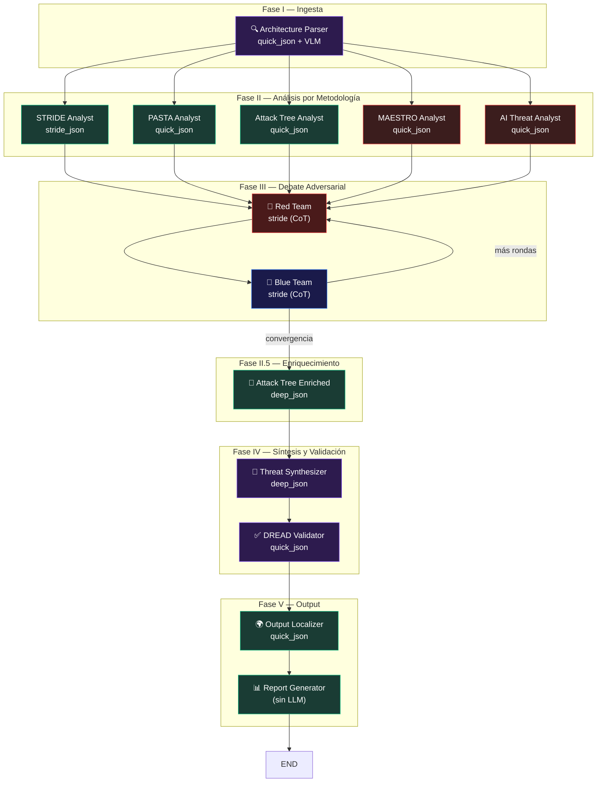
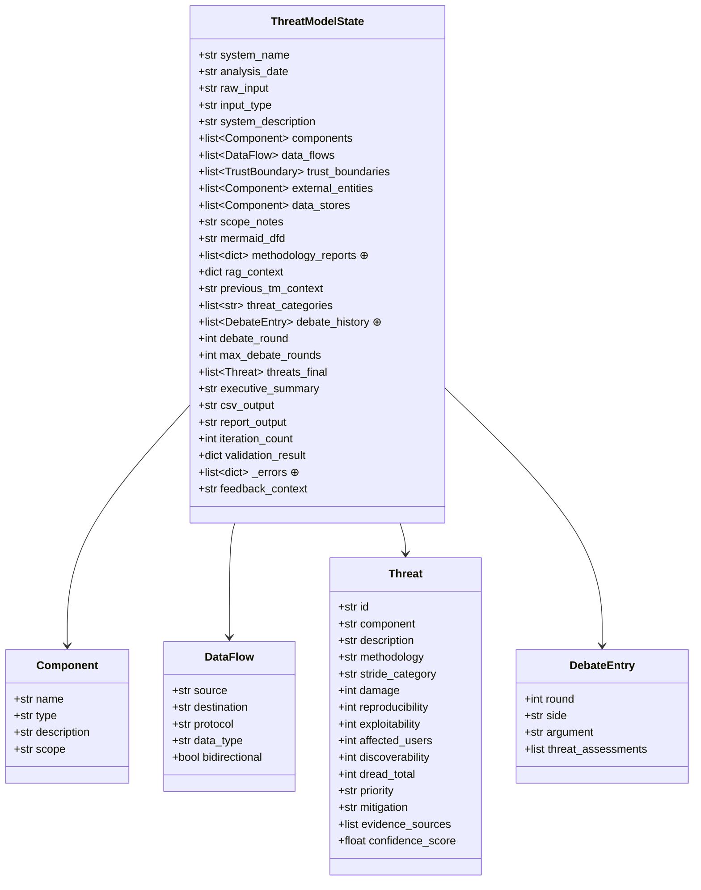
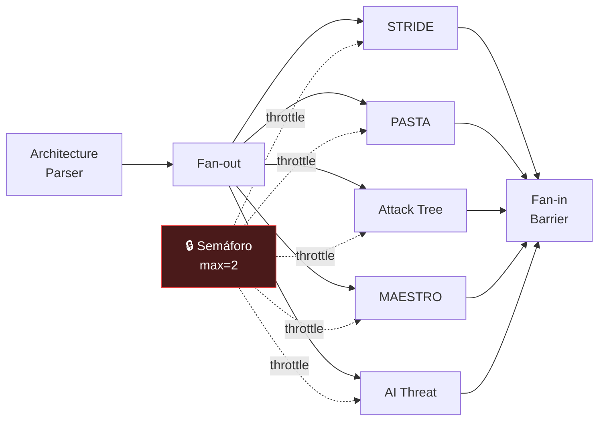
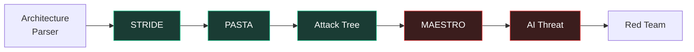
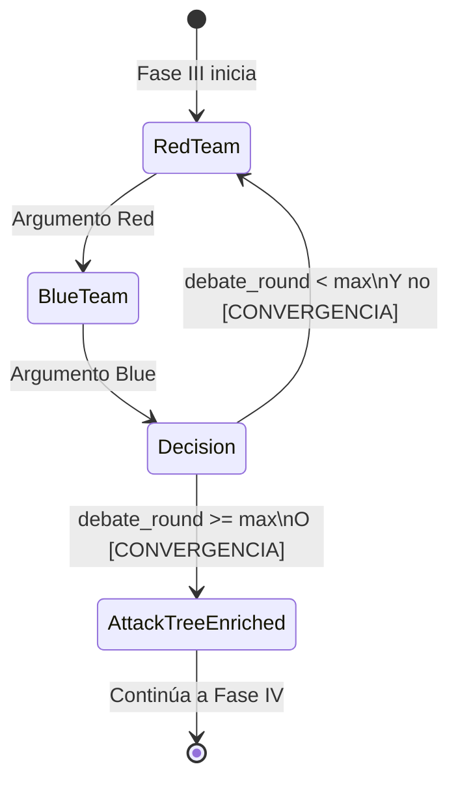

# 03 — Arquitectura del Pipeline

> 13 nodos, 6 fases, 3 modos de ejecución — la columna vertebral de AgenticTM.

---

## Visión General

El pipeline de AgenticTM es un **grafo dirigido acíclico con un ciclo condicional** (debate loop), implementado sobre [LangGraph](https://github.com/langchain-ai/langgraph). LangGraph proporciona:

- **Estado tipado** (`ThreatModelState`) compartido entre todos los nodos
- **Fan-out paralelo** con barrera de sincronización
- **Aristas condicionales** para el loop de debate
- **Acumulación automática** de listas vía `Annotated[list, operator.add]`

---

## Las 6 Fases



### Descripción de Cada Fase

| Fase | Nodos | Propósito |
|------|-------|-----------|
| **I — Ingesta** | Architecture Parser | Convierte el input del usuario (texto, Mermaid, imágenes, Draw.io) en un modelo de sistema estructurado |
| **II — Análisis** | STRIDE, PASTA, Attack Tree, MAESTRO*, AI Threat* | Cada analista aplica su metodología independientemente (* = condicional si hay AI) |
| **III — Debate** | Red Team, Blue Team | Debate adversarial de N rondas para validar y refinar amenazas |
| **II.5 — Enriquecimiento** | Attack Tree Enriched | Segunda pasada de árboles de ataque con acceso a TODO el contexto previo |
| **IV — Síntesis** | Threat Synthesizer, DREAD Validator | Consolida todas las amenazas, asigna DREAD, valida scores |
| **V — Output** | Output Localizer, Report Generator | Traduce contenido a español (si aplica), genera CSV + Markdown + LaTeX |

---

## Estado Compartido: `ThreatModelState`

El estado es un `TypedDict` que fluye por todo el grafo. Cada nodo lee lo que necesita y escribe su sección.

### Diagrama de Estado



### Campos con Acumulación Automática

Los campos marcados con `⊕` usan `Annotated[list, operator.add]`:

```python
methodology_reports: Annotated[list[dict[str, Any]], operator.add]
debate_history: Annotated[list[DebateEntry], operator.add]
_errors: Annotated[list[dict[str, Any]], operator.add]
```

Esto significa que cuando múltiples nodos escriben al mismo campo en paralelo (e.g., 5 analistas escriben a `methodology_reports`), LangGraph **concatena** automáticamente todas las listas en la barrera de sincronización. Sin esta anotación, el último nodo en terminar sobreescribiría los resultados de los demás.

---

## Modos de Ejecución de Analistas

La Fase II soporta 3 modos de ejecución, configurables en `config.json`:

### Modo Hybrid (default, recomendado)

```python
"analyst_execution_mode": "hybrid",
"max_parallel_analysts": 2
```



**Comportamiento**: Los 5 analistas se despachan en paralelo (fan-out), pero un `threading.Semaphore(2)` limita a **máximo 2 LLMs activos simultáneamente**. Los otros 3 esperan en cola. Esto preserva el pensamiento independiente de cada analista mientras limita la presión sobre GPU/VRAM.

**Cuándo usar**: Con una GPU de 16-32 GB y modelos de 8B. Es el mejor tradeoff calidad/recursos.

### Modo Parallel

```python
"analyst_execution_mode": "parallel",
"max_parallel_analysts": 5
```

Los 5 analistas corren en paralelo real sin throttling (o con un semáforo más amplio). **Requiere mucha VRAM** — con 5 modelos de 8B, necesitás ~25 GB de VRAM solo para los analistas.

**Cuándo usar**: Con múltiples GPUs o modelos muy pequeños.

### Modo Cascade

```python
"analyst_execution_mode": "cascade"
```



**Comportamiento**: Los analistas corren secuencialmente. Cada uno ve el estado acumulado de los anteriores (context inheritance). El VRAM pico es el de **un solo modelo**.

**Cuándo usar**: Con GPU muy limitada (8 GB), o cuando se desee que cada analista construya sobre los hallazgos de los previos.

**Trade-off**: Menor diversidad (riesgo de "bias-drag" — el segundo analista tiende a confirmar al primero en lugar de encontrar amenazas nuevas).

### Implementación del Throttling

```python
# En builder.py - se aplica ANTES de _safe_node
_analyst_sem = threading.Semaphore(max_concurrent)

def _throttled(fn, name: str):
    def _wrapper(state):
        _analyst_sem.acquire()
        try:
            return fn(state)
        finally:
            _analyst_sem.release()
    return _wrapper

# Aplicación:
_node_stride = _throttled(_node_stride, "stride_analyst")
_node_pasta  = _throttled(_node_pasta,  "pasta_analyst")
# ... etc.

# Después: _safe_node envuelve la versión throttled
node_stride = _safe_node(_node_stride, "stride_analyst")
```

El semáforo se aplica **antes** de `_safe_node` para que el `finally: release()` siempre se ejecute, incluso si `_safe_node` captura y suprime una excepción.

---

## Debate Loop y Convergencia

El debate entre Red Team y Blue Team implementa un **ciclo condicional** controlado por `should_continue_debate()`:



### Condiciones de Salida

1. **Cap de rondas**: `debate_round > max_debate_rounds` (configurable, default 2, máximo 10)
2. **Convergencia**: El Red Team emite `[CONVERGENCIA]` cuando no encuentra más vectores de ataque nuevos
3. **Nuevos vectores**: El Red Team puede emitir `[NUEVOS VECTORES]` para indicar que hay más por explorar

```python
def should_continue_debate(state) -> Literal["red_team", "attack_tree_enriched"]:
    current_round = state.get("debate_round", 1)
    effective_max = state.get("max_debate_rounds", max_rounds)
    
    if current_round > effective_max:
        return "attack_tree_enriched"
    
    # Buscar señal de convergencia en el último argumento Red
    last_red = next(
        (e for e in reversed(debate_history) if e.get("side") == "red"),
        None
    )
    if last_red and "[CONVERGENCIA]" in last_red.get("argument", ""):
        return "attack_tree_enriched"
    
    return "red_team"  # Continuar debatiendo
```

---

## Error Handling: `_safe_node`

Cada nodo del grafo está envuelto en `_safe_node`, que proporciona **degradación graciosa**:

```python
def _safe_node(node_fn, node_name: str):
    CRITICAL_NODES = {"architecture_parser", "threat_synthesizer"}
    
    def wrapper(state):
        try:
            return node_fn(state)
        except Exception as exc:
            if node_name in CRITICAL_NODES:
                raise  # No se puede continuar sin estos
            return {"_errors": [{
                "node": node_name,
                "error": str(exc),
                "traceback": traceback.format_exc(),
            }]}
    return wrapper
```

### Nodos Críticos vs No-Críticos

| Tipo | Nodos | Comportamiento ante error |
|------|-------|--------------------------|
| **Crítico** | `architecture_parser`, `threat_synthesizer` | Re-raise → pipeline aborta |
| **No-crítico** | Todos los demás | Log + `_errors` → pipeline continúa |

Esto significa que si un analista individual falla (e.g., timeout de Ollama), el pipeline continúa con los resultados de los otros analistas. Solo si el parser de arquitectura o el sintetizador fallan, el pipeline se detiene completamente.

---

## Asignación de Modelos por Nodo

| Nodo | Variable LLM | Tier | Modelo Default | Justificación |
|------|-------------|------|----------------|---------------|
| Architecture Parser | `quick_json` | Quick JSON | qwen3:8b | Parsing rápido de arquitectura |
| Architecture Parser (imágenes) | `vlm` | VLM | qwen3-vl:8b | Vision para diagramas |
| STRIDE Analyst | `stride_json` | Stride JSON | deepseek-r1:14b | CoT audit trail |
| PASTA Analyst | `quick_json` | Quick JSON | qwen3:8b | Narrativas de ataque rápidas |
| Attack Tree (initial) | `quick_json` | Quick JSON | qwen3:8b | Árboles iniciales |
| MAESTRO Analyst | `quick_json` | Quick JSON | qwen3:8b | Análisis MAESTRO |
| AI Threat Analyst | `quick_json` | Quick JSON | qwen3:8b | Análisis AI/Agéntico |
| Red Team | `stride` | Stride (free-text) | deepseek-r1:14b | CoT visible en debate |
| Blue Team | `stride` | Stride (free-text) | deepseek-r1:14b | CoT visible en debate |
| Attack Tree (enriched) | `deep_json` | Deep JSON | qwen3:30b-a3b | 2da pasada con contexto completo |
| Threat Synthesizer | `deep_json` | Deep JSON | qwen3:30b-a3b | Síntesis de 15+ amenazas |
| DREAD Validator | `quick_json` | Quick JSON | qwen3:8b | Scoring rápido |
| Output Localizer | `quick_json` | Quick JSON | qwen3:8b | Traducción rápida |
| Report Generator | *(ninguno)* | — | — | Código puro, sin LLM |

---

## Construcción del Grafo

El grafo se construye en `agentictm/graph/builder.py` con dos funciones:

### `build_graph(config, llm_factory) -> StateGraph`

1. Importa todas las funciones `run_*` de los agentes
2. Crea instancias LLM vía `LLMFactory`
3. Crea wrappers de nodos (`_node_stride`, `_node_pasta`, etc.)
4. Aplica throttling (`_throttled`) según el modo de ejecución
5. Aplica error handling (`_safe_node`)
6. Construye el `StateGraph(ThreatModelState)`
7. Agrega nodos y aristas según el modo (parallel/cascade)
8. Configura la arista condicional del debate

### `compile_graph(config, llm_factory)`

Llama a `build_graph` y luego `.compile()` para obtener un ejecutable.

### Uso desde `core.py`

```python
class AgenticTM:
    def __init__(self, config):
        self.llm_factory = LLMFactory(...)
        from agentictm.graph.builder import compile_graph
        self._app = compile_graph(self.config, self.llm_factory)
    
    def analyze(self, system_input, system_name, ...):
        initial_state = {
            "system_name": system_name,
            "raw_input": system_input,
            "debate_round": 1,
            "methodology_reports": [],
            "debate_history": [],
            ...
        }
        result = self._app.invoke(initial_state)
        return result
```

---

## Topología Detallada del Grafo

### Modo Parallel/Hybrid

```
Entry Point
    │
    ▼
architecture_parser
    │
    ├──── stride_analyst ──────┐
    ├──── pasta_analyst ───────┤
    ├──── attack_tree_analyst ─┤  (fan-out, throttled)
    ├──── maestro_analyst ─────┤
    └──── ai_threat_analyst ───┘
                               │
                               ▼
                    red_team ◄──────┐
                        │           │
                        ▼           │
                    blue_team ──────┘ (loop condicional)
                        │
                        ▼
              attack_tree_enriched
                        │
                        ▼
              threat_synthesizer
                        │
                        ▼
                dread_validator
                        │
                        ▼
              output_localizer
                        │
                        ▼
              report_generator
                        │
                        ▼
                       END
```

### Modo Cascade

```
Entry Point
    │
    ▼
architecture_parser
    │
    ▼
stride_analyst
    │
    ▼
pasta_analyst
    │
    ▼
attack_tree_analyst
    │
    ▼
maestro_analyst
    │
    ▼
ai_threat_analyst
    │
    ▼
red_team ◄──────┐
    │           │
    ▼           │
blue_team ──────┘ (loop condicional)
    │
    ▼
attack_tree_enriched
    │
    ▼
threat_synthesizer
    │
    ▼
dread_validator
    │
    ▼
output_localizer
    │
    ▼
report_generator
    │
    ▼
   END
```

---

## Métricas por Agente

Cada invocación de agente registra métricas vía `get_agent_metrics()` / `clear_agent_metrics()` en `base.py`:

```python
class AgentMetrics:
    agent_name: str
    execution_time_seconds: float
    llm_calls: int
    tool_calls: int
    json_parse_strategy: str  # "direct" | "cleaned" | "regex" | "markdown_extract" | "fallback"
    threats_produced: int
    self_reflection_applied: bool
    errors: list[str]
```

Estas métricas se recopilan durante la ejecución pero actualmente no se persisten (item del backlog: dashboard de calidad).

---

*[← 02 — Fundamentos Académicos](02_fundamentos_academicos.md) · [04 — Agentes en Profundidad →](04_agentes.md)*
