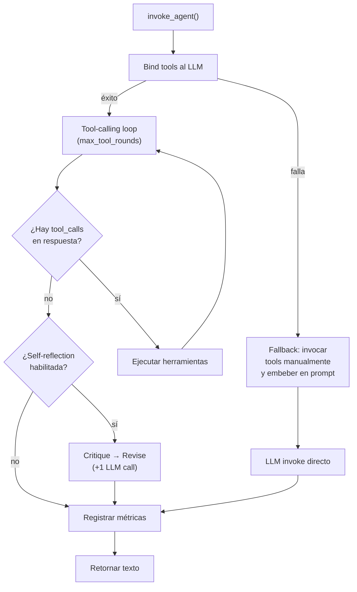
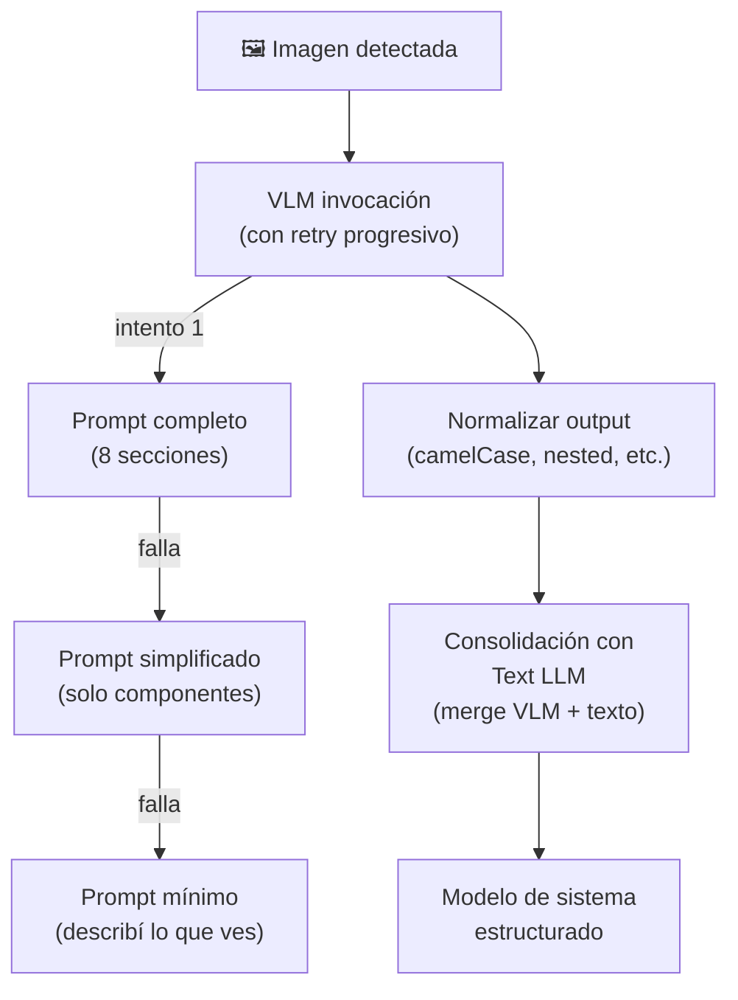
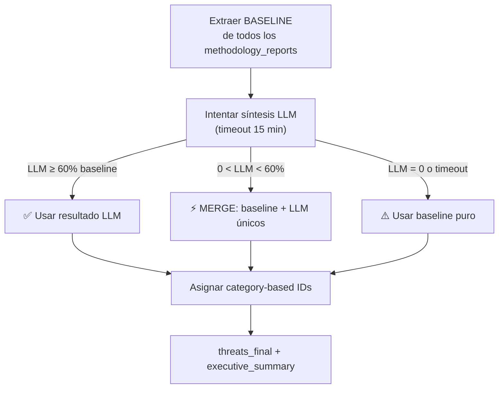

# 04 — Agentes en Profundidad

> Cada uno de los 13 nodos del pipeline: su rol, prompt, inputs/outputs, herramientas RAG y tier de LLM.

---

## Inventario de Agentes

| # | Agente | Archivo | Líneas | LLM Tier | RAG Tools | Fase |
|---|--------|---------|--------|----------|-----------|------|
| 1 | Architecture Parser | `architecture_parser.py` | 1064 | quick_json + VLM | Ninguna | I |
| 2 | STRIDE Analyst | `stride_analyst.py` | 152 | stride_json | ANALYST_TOOLS | II |
| 3 | PASTA Analyst | `pasta_analyst.py` | 142 | quick_json | ANALYST_TOOLS | II |
| 4 | Attack Tree Analyst | `attack_tree_analyst.py` | 294 | quick_json / deep_json | ANALYST_TOOLS | II / II.5 |
| 5 | MAESTRO Analyst | `maestro_analyst.py` | 191 | quick_json | AI_ANALYST_TOOLS | II |
| 6 | AI Threat Analyst | `ai_threat_analyst.py` | 498 | quick_json | AI_ANALYST_TOOLS | II |
| 7 | Red Team Debater | `debate.py` | 475 | stride | DEBATE_TOOLS | III |
| 8 | Blue Team Debater | `debate.py` | 475 | stride | DEBATE_TOOLS | III |
| 9 | Threat Synthesizer | `threat_synthesizer.py` | 832 | deep_json | SYNTHESIS_TOOLS | IV |
| 10 | DREAD Validator | `dread_validator.py` | 447 | quick_json | VALIDATOR_TOOLS | IV |
| 11 | Output Localizer | `output_localizer.py` | 178 | quick_json | Ninguna | V |
| 12 | Report Generator | `report_generator.py` | 731 | *(ninguno)* | Ninguna | V |

---

## Infraestructura Común: `base.py` (755 líneas)

Todos los agentes comparten la infraestructura de invocación definida en `agentictm/agents/base.py`:

### `invoke_agent()` — Loop Principal



### Funciones Clave

| Función | Propósito |
|---------|-----------|
| `build_messages(system_prompt, human_prompt)` | Construye `[SystemMessage, HumanMessage]` |
| `_invoke_tools_into_prompt(tools, human_prompt, agent_name)` | Fallback para modelos sin tool-calling: pre-invoca RAG tools y embebe resultados en el prompt |
| `_llm_invoke_with_retry(llm, messages, prefix)` | Retry con backoff exponencial (3 intentos, 2-30s) vía `tenacity` |
| `_strip_think_tags(text)` | Strip `<think>...</think>` de modelos reasoning (Qwen3, DeepSeek-R1) |
| `_self_reflect(llm, original_output, system_prompt, agent_name)` | Ciclo critique → revise para mejorar calidad |
| `extract_json_from_response(text)` | Extracción multi-estrategia de JSON: code blocks → full text → balanced brackets → common fixes |
| `parse_structured_response(text, model, many)` | Validación Pydantic con fallback chain |
| `extract_threats_from_markdown(text, methodology)` | Parser fallback: Markdown → dict de amenazas |

### Extracción JSON Multi-Estrategia

Cuando un LLM devuelve JSON, `extract_json_from_response` intenta 5 estrategias en orden:

1. **Code blocks**: Busca ` ```json ... ``` ` en la respuesta
2. **Full text**: Intenta `json.loads()` sobre el texto limpio completo
3. **Balanced brackets**: Busca el primer `{` y su `}` balanceado
4. **Common fixes**: Repara JSON malformado (trailing commas, single quotes, etc.)
5. **Markdown fallback**: Extrae amenazas de texto Markdown con headers/bullets

### Self-Reflection (Opcional)

Cuando `self_reflection_enabled = True` en config, cada agente pasa por un ciclo adicional:

```
Output original → Critic prompt ("¿Qué mejorarías?") → Revision prompt ("Revisá tu output") → Output mejorado
```

Esto agrega ~30 segundos por agente pero mejora la calidad de outputs. Está deshabilitado por defecto.

---

## 1. Architecture Parser (Fase I)

> **Archivo**: `architecture_parser.py` · **1064 líneas** · **LLM**: quick_json + VLM

### Rol
Punto de entrada del pipeline. Convierte el input del usuario en un **modelo de sistema estructurado** (componentes, flujos, trust boundaries, data stores, entidades externas, DFD Mermaid).

### Input → Output

| Lee del estado | Escribe al estado |
|----------------|-------------------|
| `raw_input` | `input_type`, `system_description`, `components`, `data_flows`, `trust_boundaries`, `external_entities`, `data_stores`, `scope_notes`, `mermaid_dfd` |

### Detección de Tipo de Input

```python
def _detect_input_type(raw_input):
    # Retorna: "text" | "mermaid" | "image" | "drawio" | "mixed"
```

| Tipo | Detección | Procesamiento |
|------|-----------|---------------|
| `text` | Sin marcadores especiales | Text LLM directo |
| `mermaid` | Contiene `graph`, `flowchart`, `sequenceDiagram` | Mermaid parser + Text LLM |
| `image` | Paths a `.png/.jpg/.svg/.webp` | VLM (Vision) + Text LLM consolidación |
| `drawio` | Contiene XML Draw.io | Extracción de texto + Text LLM |
| `mixed` | Texto + imágenes mezclados | VLM para imágenes + Text LLM para texto + consolidación |

### System Prompt (extracto)

> Sos un ingeniero principal de clase mundial. Tu ÚNICA responsabilidad es extraer la arquitectura del sistema — NO realizar análisis de seguridad.

El prompt instruye al LLM a producir JSON con 8 secciones:
1. `system_description` — Resumen ejecutivo de 3-4 párrafos
2. `components` — Array con name, type, description, technology, scope, interfaces, dependencies
3. `data_flows` — source, destination, protocol, data_type, authentication
4. `trust_boundaries` — name, components_inside, components_outside, boundary_type
5. `external_entities` — name, type, description
6. `data_stores` — name, type, technology, sensitivity, encryption
7. `api_endpoints` — path, method, authentication, data_classification
8. `deployment_info` — environment, cloud_provider, orchestration, ci_cd

### Flujo para Imágenes (VLM)



### Generación de DFD Mermaid

Al final, `_generate_mermaid_dfd()` genera un diagrama de flujo de datos en Mermaid `flowchart LR` basándose en los componentes y flujos extraídos.

---

## 2. STRIDE Analyst (Fase II)

> **Archivo**: `stride_analyst.py` · **152 líneas** · **LLM**: stride_json (DeepSeek-R1:14b)

### Rol
Analiza cada elemento del sistema aplicando las 6 categorías STRIDE. Usa DeepSeek-R1 para producir **Chain-of-Thought visible** como audit trail.

### Input → Output

| Lee del estado | Escribe al estado |
|----------------|-------------------|
| `system_description`, `components`, `data_flows`, `trust_boundaries`, `data_stores`, `scope_notes` | `methodology_reports` (append) |

### RAG Tools: `ANALYST_TOOLS`
- `rag_query_books` — Libros de threat modeling
- `rag_query_research` — Papers de investigación
- `rag_query_risks` — Riesgos y mitigaciones
- `rag_query_previous_tms` — Threat models previos

### System Prompt (extracto)

> Sos un analista de amenazas especializado en la metodología STRIDE. Tu tarea es realizar un análisis STRIDE-per-element exhaustivo del sistema. Para CADA componente, flujo de datos y trust boundary, evaluá cuál de las 6 categorías STRIDE aplica.

### Schema de Output

```json
{
  "methodology": "STRIDE",
  "threats": [{
    "component": "API Gateway",
    "stride_category": "S",
    "description": "Descripción developer-friendly (3-5 oraciones: QUÉ, CÓMO, DAÑO)",
    "impact": "High|Medium|Low",
    "reasoning": "Razonamiento paso a paso",
    "references": "CAPEC-XX, CWE-XX, ATT&CK Txxxx",
    "evidence_sources": [{"source_type": "rag", "source_name": "...", "excerpt": "..."}],
    "confidence_score": 0.85
  }],
  "summary": "Resumen del análisis"
}
```

---

## 3. PASTA Analyst (Fase II)

> **Archivo**: `pasta_analyst.py` · **142 líneas** · **LLM**: quick_json (Qwen3:8b)

### Rol
Analiza desde la perspectiva del atacante con foco en riesgo de negocio. Produce **narrativas de ataque** (attack stories).

### Input → Output

| Lee del estado | Escribe al estado |
|----------------|-------------------|
| `system_description`, `components`, `data_flows`, `trust_boundaries`, `external_entities`, `scope_notes` | `methodology_reports` (append) |

### RAG Tools: `ANALYST_TOOLS`

### System Prompt (extracto)

> Sos un especialista en la metodología PASTA (7 etapas, enfoque risk-centric). Razoná desde la perspectiva del atacante. Escribí narrativas de ataque developer-friendly.

### Schema de Output

```json
{
  "methodology": "PASTA",
  "business_context": "Contexto de negocio del sistema",
  "threats": [{
    "attack_scenario": "Narrativa de 3-5 oraciones",
    "target_asset": "Ledger de transacciones",
    "attack_path": ["1. Obtener acceso...", "2. Explotar...", "3. Exfiltrar..."],
    "likelihood": "High|Medium|Low",
    "business_impact": "Descripción del impacto de negocio",
    "risk_level": "High|Medium|Low",
    "vulnerabilities_exploited": "CWE-XX, CVE-XXXX"
  }]
}
```

---

## 4. Attack Tree Analyst (Fase II + Fase II.5)

> **Archivo**: `attack_tree_analyst.py` · **294 líneas** · **LLM**: quick_json (inicial) / deep_json (enriched)

### Rol
Genera árboles de ataque jerárquicos con operadores AND/OR. Tiene **dos pasadas**:

- **Inicial (Fase II)**: 3-5 árboles basados solo en la arquitectura
- **Enriched (Fase II.5)**: 5-7 árboles con acceso a TODOS los outputs previos (post-debate)

### Input → Output

| Pasada | Lee del estado | Escribe al estado |
|--------|----------------|-------------------|
| Inicial | `system_description`, `components`, `data_flows`, `trust_boundaries`, `data_stores`, `scope_notes` | `methodology_reports` (append) |
| Enriched | Todo lo anterior + `methodology_reports`, `debate_history` | `methodology_reports` (append) |

### System Prompt — Inicial (extracto)

> Sos un analista de árboles de ataque. Construís árboles jerárquicos (raíz = objetivo del atacante, nodos = sub-objetivos AND/OR, hojas = acciones concretas). Identificá los 3-5 principales objetivos de un atacante. Generá diagramas Mermaid `graph TD`.

### System Prompt — Enriched (extracto)

> Sos un analista sénior haciendo tu SEGUNDA PASADA. Tenés acceso a TODOS los outputs previos (STRIDE, PASTA, MAESTRO, AI Threats, árboles iniciales, debate Red/Blue). Generá 5-7 árboles enriquecidos combinando insights cross-metodología.

### Schema de Output

```json
{
  "methodology": "ATTACK_TREE",
  "attack_trees": [{
    "root_goal": "Exfiltrar PII de usuarios",
    "tree_mermaid": "graph TD\n  A[Root] --> B[...]",
    "cheapest_path": "SQL Injection → Data Exfil",
    "cheapest_path_difficulty": "Low",
    "threats": [{
      "leaf_action": "SQL Injection en API pública",
      "component": "API Gateway",
      "difficulty": "Low",
      "mitre_technique": "T1190"
    }]
  }]
}
```

---

## 5. MAESTRO Analyst (Fase II, Condicional)

> **Archivo**: `maestro_analyst.py` · **191 líneas** · **LLM**: quick_json

### Rol
Especialista en amenazas AI/agénticas usando CSA MAESTRO 7-Layer + OWASP Agentic AI Top 10. **Solo se activa si el sistema tiene componentes AI**.

### Activación Condicional

```python
AI_KEYWORDS = [
    "ai", "ml", "llm", "model", "gpt", "agent", "agentic", "rag",
    "vector", "embedding", "neural", "prompt", "inference", "training",
    "langchain", "langgraph", "ollama", "openai", "anthropic", ...
]

def _has_ai_components(state) -> bool:
    text = (description + component_names + raw_input + reports).lower()
    return any(kw in text for kw in AI_KEYWORDS)
```

Si no hay componentes AI, retorna `{"methodology_reports": []}` (vacío, no falla).

### Input → Output

| Lee del estado | Escribe al estado |
|----------------|-------------------|
| `system_description`, `components`, `data_flows`, `scope_notes`, `raw_input`, `methodology_reports` | `methodology_reports` (append) |

### RAG Tools: `AI_ANALYST_TOOLS`
Incluye `rag_query_ai_threats` (PLOT4ai, OWASP AI) además de las tools estándar.

### Schema de Output

```json
{
  "methodology": "MAESTRO",
  "threats": [{
    "component": "RAG Pipeline",
    "maestro_layer": "L2",
    "owasp_id": "ASI07",
    "description": "Context poisoning via malicious document injection...",
    "attack_vector": "Uploaded PDF with embedded prompt injection",
    "evidence_sources": [...],
    "confidence_score": 0.8
  }]
}
```

---

## 6. AI Threat Analyst (Fase II, Condicional)

> **Archivo**: `ai_threat_analyst.py` · **498 líneas** · **LLM**: quick_json

### Rol
El agente más completo del pipeline. Analiza amenazas AI usando **6 frameworks simultáneamente**. Solo se activa si hay componentes AI (~60 keywords de detección, más amplio que MAESTRO).

### Frameworks Evaluados

1. **PLOT4ai** — 8 categorías de riesgo AI
2. **OWASP Top 10 LLM 2025** (LLM01-LLM10)
3. **OWASP Agentic AI Top 10 2026** (ASI01-ASI10)
4. **CSA MAESTRO 7-Layer** — Propagación cross-layer
5. **AI Agent Protocol Security Taxonomy** (CIC/UNB 2026) — 32 amenazas de protocolos
6. **Context-CIA** — Reinterpretación de CIA para contexto AI

### Detección Dinámica de Protocolos

```python
PROTOCOL_KEYWORDS = {
    "MCP": ["mcp", "model context protocol", "tool_server"],
    "A2A": ["a2a", "agent-to-agent", "agent2agent"],
    "Agora": ["agora", "agora protocol"],
    "ANP": ["anp", "agent network protocol"],
}
```

Si detecta MCP/A2A/Agora/ANP, agrega instrucciones de análisis específicas al prompt.

### Métricas Cuantitativas

Cada amenaza incluye:

| Métrica | Fórmula | Escala |
|---------|---------|--------|
| **WEI** (Workflow Exploitability Index) | $\text{attack\_complexity} \times \text{business\_impact} \times \text{layer\_weight}$ | 0-10 |
| **RPS** (Risk Propagation Score) | Capas downstream afectadas | 1-7 (>3.0 = crítico) |
| **VR** (Violation Rate) | Prob. misbinding bajo tool ambiguity | 0.0-1.0 (>0.5 = crítico) |

### Schema de Output (parcial)

```json
{
  "methodology": "AI_THREAT",
  "threats": [{
    "framework": "OWASP_AGENTIC_2026",
    "category": "ASI04",
    "maestro_layer": "L5",
    "protocol_threat_class": "Supply Chain & Ecosystem Integrity",
    "wei_score": 7.5,
    "rps_score": 4.2,
    "violation_rate": 0.6,
    "context_cia_impact": {"confidentiality": "High", "integrity": "Medium"},
    "cross_layer_risks": ["L3→L5", "L5→L7"],
    "protocol_risks": [{"protocol": "MCP", "threat": "Tool Injection"}],
    "questions_to_evaluate": ["¿Qué sandbox existe para tool execution?"]
  }]
}
```

---

## 7-8. Red Team y Blue Team Debaters (Fase III)

> **Archivo**: `debate.py` · **475 líneas** · **LLM**: stride (DeepSeek-R1:14b, free-text CoT)

### Rol
Debate adversarial de N rondas donde el Red Team ataca y el Blue Team defiende. Usan DeepSeek-R1 para **Chain-of-Thought visible** que enriquece el análisis.

### Red Team — System Prompt (extracto)

> Sos un experimentado Red Teamer / Penetration Tester / Simulador Adversarial. Estudiás TODOS los reportes de metodologías. Referenciás amenazas por ID. Combinás cadenas de ataque cross-metodología. Desafiás supuestos. Proponés escenarios APT.

### Blue Team — System Prompt (extracto)

> Sos un Senior Blue Teamer / Security Architect / Incident Response Lead. Revisás los assessments del Red Team. Emitís veredictos por threat ID.

### Contexto Compartido

`_build_full_context()` construye un contexto completo que ambos debaters reciben:
- Input original del usuario
- Descripción del sistema + componentes + flujos + boundaries
- TODOS los reportes de metodologías con sus amenazas
- Árboles de ataque iniciales
- Historial de debate previo (rondas anteriores)

### Schema de Output

**Red Team:**
```json
{
  "threat_assessments": [{
    "threat_id": "TM-003",
    "action": "ESCALATE|CONFIRM|NEW_THREAT",
    "reasoning": "...",
    "proposed_dread_total": 42,
    "attack_chain": "STRIDE-S-001 → PASTA-002 → lateral movement"
  }]
}
```

**Blue Team:**
```json
{
  "threat_assessments": [{
    "threat_id": "TM-003",
    "verdict": "CONCEDE|DISPUTE|MODERATE",
    "reasoning": "...",
    "existing_controls": "WAF + rate limiting",
    "mitigation": "Add mutual TLS for internal services",
    "control_reference": "NIST SC-8"
  }]
}
```

### Señales de Convergencia

El Red Team termina su argumento con una de estas señales:
- `[CONVERGENCIA]` — No hay más vectores nuevos, debate debe terminar
- `[NUEVOS VECTORES]` — Hay más por explorar, debate debe continuar

---

## 9. Threat Synthesizer (Fase IV)

> **Archivo**: `threat_synthesizer.py` · **832 líneas** · **LLM**: deep_json (Qwen3:30b-a3b MoE)

### Rol
El agente más **crítico** del pipeline. Consolida TODAS las amenazas de todas las metodologías + debate en un threat model unificado. Usa el Deep Thinker (30B MoE) para manejar el contexto masivo (15-30K tokens).

### Input → Output

| Lee del estado | Escribe al estado |
|----------------|-------------------|
| `system_description`, `components`, `trust_boundaries`, `data_flows`, `methodology_reports`, `debate_history`, `previous_tm_context` | `threats_final`, `executive_summary`, `report_output` |

### RAG Tools: `SYNTHESIS_TOOLS`
- `rag_query_previous_tms` — TMs previos como referencia de formato
- `rag_query_risks` — Riesgos y mitigaciones para completar controles
- `rag_query_ai_threats` — Amenazas AI para contexto adicional

### Estrategia Híbrida



### Categorías e IDs

Cada amenaza recibe un ID basado en su categoría:

| Categoría | Prefijo | Ejemplo |
|-----------|---------|---------|
| Infraestructura y Cumplimiento | INF | INF-01, INF-02 |
| Privacidad y Lógica de Negocio | PRI | PRI-01, PRI-02 |
| Vulnerabilidades Web y API | WEB | WEB-01, WEB-02 |
| Riesgos de Integración Agéntica | AGE | AGE-01, AGE-02 |
| Amenazas Nativas de IA y LLM | LLM | LLM-01, LLM-02 |
| Factores Humanos y Gobernanza | HUM | HUM-01, HUM-02 |
| Amenazas Generales | GEN | GEN-01, GEN-02 |

### Inferencia STRIDE

`_infer_stride_category()` asigna categoría STRIDE cuando el agente no la provee, usando ~12 keywords por letra:

```python
STRIDE_PATTERNS = {
    "S": ["spoof", "impersonat", "identity", "credential", "authentication bypass", ...],
    "T": ["tamper", "modif", "integrity", "inject", "alter", "corrupt", ...],
    "R": ["repudi", "non-repudiation", "audit", "log", "accountability", ...],
    "I": ["disclos", "leak", "expos", "confidential", "exfiltrat", ...],
    "D": ["denial", "dos", "ddos", "flood", "exhaust", "unavailab", ...],
    "E": ["privilege", "escalat", "authorization", "access control", ...],
}
```

### Mitigaciones Default por STRIDE

Si el LLM no propone mitigaciones, se aplican defaults:

| STRIDE | Mitigación Default | Control |
|--------|-------------------|---------|
| S | Multi-factor authentication, strong credential management | NIST IA-2, OWASP ASVS 2.1 |
| T | Input validation, integrity checks, digital signatures | NIST SI-7, OWASP ASVS 5.1 |
| R | Comprehensive logging, audit trails, secure timestamps | NIST AU-3, OWASP ASVS 7.1 |
| I | Encryption at rest/transit, access controls, data masking | NIST SC-8, OWASP ASVS 8.1 |
| D | Rate limiting, resource quotas, redundancy, auto-scaling | NIST SC-5, OWASP ASVS 11.1 |
| E | Least privilege, RBAC, input validation, secure defaults | NIST AC-6, OWASP ASVS 4.1 |

### System Prompt (extracto)

> Sos el Lead Security Architect y sintetizador final. Tu rol es la pieza más CRÍTICA del pipeline. CONSOLIDÁ todas las amenazas de todas las metodologías. MÍNIMO MANDATORIO: 15 amenazas distintas. INCORPORÁ el debate. ASIGNÁ scores DREAD. PRIORIZÁ. PROPONÉ mitigaciones mapeadas a NIST 800-53, OWASP ASVS, CIS Controls. Descripciones VERBOSE y developer-friendly (4-6 oraciones).

---

## 10. DREAD Validator (Fase IV)

> **Archivo**: `dread_validator.py` · **447 líneas** · **LLM**: quick_json

### Rol
Valida y corrige los scores DREAD asignados por el Synthesizer. Revisa cada amenaza contra la arquitectura real para ajustar sobre/sub-scoring.

### Input → Output

| Lee del estado | Escribe al estado |
|----------------|-------------------|
| `threats_final`, `raw_input`, `system_description`, `components`, `data_flows`, `trust_boundaries`, `methodology_reports`, `debate_history`, `system_name`, `threat_categories` | `threats_final` (overwrite con scores validados) |

### RAG Tools: `VALIDATOR_TOOLS`
- `rag_query_previous_tms` — Para comparar scoring con TMs anteriores
- `rag_query_risks` — Para verificar si riesgos están bien evaluados

### Guardrails

1. **Nunca perder amenazas**: Si el validador retorna <80% del count original, se hace merge:
   - Se toman los scores actualizados del validador
   - Las amenazas faltantes se preservan con sus scores originales

2. **Solo actualizar scores**: Del output del validador solo se toman `damage`, `reproducibility`, `exploitability`, `affected_users`, `discoverability`, `dread_total`, `priority` y `observations`. Descripción, mitigaciones y attack_path se preservan del original.

3. **Recálculo de prioridad**: Después del merge, se recalcula la prioridad de todas las amenazas basándose en el DREAD total ajustado.

### System Prompt (extracto)

> Sos un analista sénior de riesgos de seguridad validando scores DREAD. Revisá cada amenaza contra la arquitectura real. Validá D/R/E/A/D (1-10). Ajustá sobre/sub-scoring. Asegurá consistencia cross-amenaza. Recalculá prioridades. Podés agregar hasta 5 amenazas faltantes. NUNCA eliminés amenazas — ajustá scores.

---

## 11. Output Localizer (Fase V)

> **Archivo**: `output_localizer.py` · **178 líneas** · **LLM**: quick_json

### Rol
Traduce contenido de inglés a español neutro profesional. **Solo se activa cuando** `output_language = "es"`.

### Qué Traduce

| Contenido | ¿Se traduce? | Razón |
|-----------|-------------|-------|
| `mermaid_dfd` (labels) | ✅ | Labels de nodos y aristas |
| `debate_history` | ✅ | Argumentos en prosa |
| `methodology_reports` (attack tree labels) | ✅ | Labels de árboles Mermaid |
| `threats_final` | ❌ | Ya se generan en español por el Synthesizer |
| `executive_summary` | ❌ | Ya se genera en español por el Synthesizer |

### Reglas de Traducción

1. Preservar estructura JSON y nombres de campos
2. No modificar valores numéricos, IDs, prioridades
3. Solo traducir campos de texto natural
4. Preservar sintaxis Mermaid, traducir labels
5. Mantener términos técnicos en inglés (JWT, SSRF, XSS, SQL Injection)

---

## 12. Report Generator (Fase V)

> **Archivo**: `report_generator.py` · **731 líneas** · **Sin LLM** (código puro)

### Rol
Genera los outputs finales: CSV, Markdown y LaTeX. Es el **único agente que no usa LLM** — todo es código determinístico.

### Outputs Generados

| Output | Formato | Contenido |
|--------|---------|-----------|
| `csv_output` | CSV (16 columnas) | Amenazas con STRIDE + DREAD + mitigaciones |
| `report_output` | Markdown | Reporte completo con resumen, DFD, tablas, debate, árboles |
| *(LaTeX integrado en Markdown)* | LaTeX | Reporte profesional con `longtable`, color-coding |

### Columnas CSV

```
ID Amenaza, Escenario de Amenaza, STRIDE, Control de Amenaza,
D, R, E, A, D.1, Puntaje DREAD, Prioridad, Estado,
Tratamiento de Riesgo, Jira Ticket, Justificación/Observaciones
```

### Estructura del Reporte Markdown

1. **Encabezado** con nombre del sistema y fecha
2. **Resumen Ejecutivo** (`executive_summary`)
3. **Diagrama de Flujo de Datos** (Mermaid DFD)
4. **Tabla de Amenazas** (agrupada por categoría con 7 clasificaciones)
5. **Detalle por Amenaza** (descripción, attack_path, mitigación, DREAD, evidencia)
6. **Análisis DREAD** (tabla con desglose D/R/E/A/D por amenaza)
7. **Historial de Debate** (Red Team vs Blue Team por ronda)
8. **Árboles de Ataque** (Mermaid trees de los reportes de Attack Tree)

### Clasificación de Amenazas en Reporte

Las amenazas se agrupan en las mismas 6+1 categorías del Synthesizer:

| Categoría | Keywords de Clasificación |
|-----------|--------------------------|
| Infraestructura y Cumplimiento | infra, container, kubernetes, docker, network, firewall, deploy, cloud, compliance, tls, certificate |
| Privacidad y Lógica de Negocio | privacy, pii, gdpr, personal, consent, business logic, payment, financial, transaction |
| Vulnerabilidades Web y API | web, api, xss, csrf, injection, sql, http, endpoint, cors, cookie, session, rest, graphql |
| Riesgos de Integración Agéntica | agent, mcp, a2a, tool, function calling, plugin, protocol, inter-agent |
| Amenazas Nativas de IA y LLM | ai, ml, llm, model, prompt, embedding, rag, vector, hallucination, training, poisoning |
| Factores Humanos y Gobernanza | human, social engineering, phishing, insider, governance, audit, compliance |
| Amenazas Generales | *(fallback para las que no matchean ninguna categoría)* |

---

## Resumen de Herramientas RAG por Agente

| Tool Set | Herramientas | Agentes que lo usan |
|----------|-------------|---------------------|
| `ANALYST_TOOLS` | books, research, risks, previous_tms | STRIDE, PASTA, Attack Tree |
| `AI_ANALYST_TOOLS` | books, research, risks, ai_threats, previous_tms | MAESTRO, AI Threat |
| `DEBATE_TOOLS` | books, research, risks, ai_threats, previous_tms | Red Team, Blue Team |
| `SYNTHESIS_TOOLS` | previous_tms, risks, ai_threats | Threat Synthesizer |
| `VALIDATOR_TOOLS` | previous_tms, risks | DREAD Validator |
| *(ninguno)* | — | Architecture Parser, Output Localizer, Report Generator |

---

*[← 03 — Arquitectura del Pipeline](03_arquitectura_pipeline.md) · [05 — Sistema RAG →](05_sistema_rag.md)*
