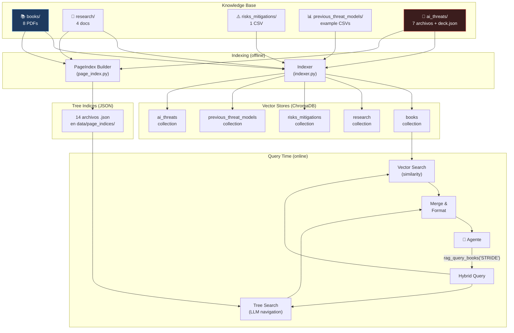
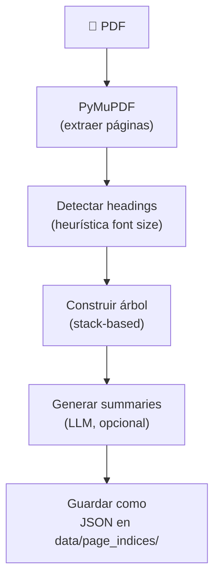
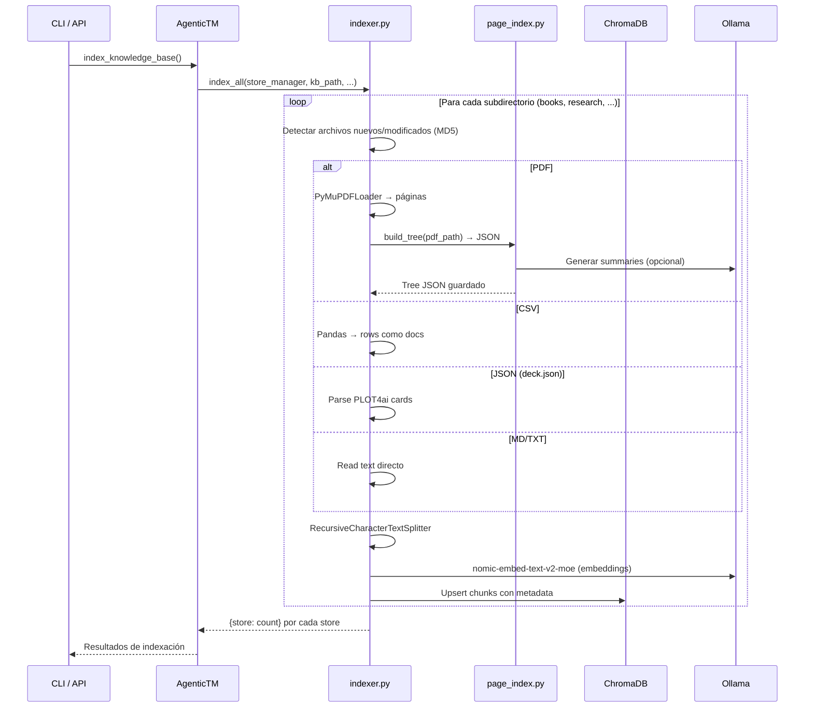

# 05 — Sistema RAG

> Arquitectura dual ChromaDB + PageIndex: cómo AgenticTM consulta su knowledge base.

---

## Visión General

El sistema RAG (Retrieval-Augmented Generation) de AgenticTM combina **dos estrategias de retrieval** para maximizar la calidad del contexto proporcionado a los agentes:

1. **Vector Search** (ChromaDB) — Búsqueda por similitud semántica sobre chunks de documentos
2. **Tree Navigation** (PageIndex) — Navegación estructural por la tabla de contenidos de PDFs



---

## Knowledge Base: Estructura

```
knowledge_base/
├── books/              # 8 PDFs — Libros de threat modeling
│   ├── Threat_Modeling_Designing_for_Security.pdf
│   ├── OWASP_Testing_Guide.pdf
│   └── ...
├── research/           # 4 docs — Papers y guías
│   ├── advanced_threat_modeling_techniques.md
│   └── ...
├── risks_mitigations/  # 1 CSV — Base de riesgos genéricos
│   └── risks_controls_mapping.csv
├── previous_threat_models/  # Example CSVs — prior threat models
│   ├── example_mobile_wallet.csv
│   ├── example_chatbot.csv
│   ├── example_biometric_enrollment.csv
│   └── ...
└── ai_threats/         # 7+ archivos — Amenazas AI
    ├── deck.json       # PLOT4ai threat cards
    ├── owasp_llm_top10.pdf
    └── ...
```

### Vector Stores

Cada subdirectorio se indexa en una **colección ChromaDB** independiente:

| Store | Directorio KB | Tipos de Archivo | Uso Principal |
|-------|---------------|------------------|---------------|
| `books` | `books/` | PDF | Libros técnicos de referencia |
| `research` | `research/` | MD, PDF | Papers y guías de threat modeling |
| `risks_mitigations` | `risks_mitigations/` | CSV | Riesgos genéricos y controles |
| `previous_threat_models` | `previous_threat_models/` | CSV | TMs previos como few-shot |
| `ai_threats` | `ai_threats/` | PDF, JSON, CSV | Amenazas específicas AI/ML |

### Embeddings

- **Modelo**: `nomic-embed-text-v2-moe` (via Ollama)
- **Chunk size**: 1000 caracteres
- **Chunk overlap**: 200 caracteres
- **Splitter**: `RecursiveCharacterTextSplitter` (de LangChain)
- **Tamaño del modelo**: ~274 MB

---

## ChromaDB: Búsqueda Vectorial

### Indexación (`indexer.py`, 348 líneas)

El indexador procesa cada archivo según su tipo:

| Tipo | Procesamiento |
|------|---------------|
| **PDF** | `PyMuPDFLoader` → páginas → chunks |
| **CSV** | Pandas → headers + rows como chunks |
| **JSON** | Detección especial de PLOT4ai deck → cards como chunks |
| **Markdown** | Texto directo → chunks |
| **TXT** | Texto directo → chunks |

#### Indexación Incremental

```python
# MD5 hash para evitar re-indexar archivos sin cambios
def _file_hash(path: Path) -> str:
    return hashlib.md5(path.read_bytes()).hexdigest()

# Solo re-indexa si el hash cambió
if current_hash != stored_hash and not force:
    # skip
```

#### PLOT4ai Deck Parser

El archivo `deck.json` contiene tarjetas de amenazas AI. El indexer lo detecta y parsea cada carta como un documento independiente:

```python
# Cada carta PLOT4ai se convierte en un chunk con metadata
for card in deck["cards"]:
    content = f"Category: {card['category']}\n"
    content += f"Title: {card['title']}\n"
    content += f"Description: {card['description']}\n"
    # ... más campos
```

### Consulta

```python
class RAGStoreManager:
    def query(self, store_name, query, top_k=5) -> str:
        store = self.get_store(store_name)  # ChromaDB collection
        results = store.similarity_search(query, k=top_k)
        # Formatea resultados con source metadata
        return formatted_text
```

---

## PageIndex: Navegación Estructural por Árboles

### Concepto

Para PDFs largos (libros de 300+ páginas), la búsqueda vectorial por chunks tiene limitaciones: un chunk de 1000 caracteres puede perder contexto de la sección completa. **PageIndex** construye un **árbol de tabla de contenidos** de cada PDF y permite navegación inteligente por secciones.

### Construcción (`page_index.py`, 471 líneas)



#### Detección de Headings

```python
# Heurística: un bloque de texto con font_size > promedio * 1.3 es un heading
# Los headings se jerarquizan por font_size (más grande = nivel superior)
for block in page.get_text("dict")["blocks"]:
    for line in block["lines"]:
        for span in line["spans"]:
            if span["size"] > avg_size * 1.3:
                # Es un heading
```

#### Estructura del Árbol

```json
{
  "doc_name": "Threat_Modeling_Designing_for_Security.pdf",
  "root": {
    "title": "Threat Modeling: Designing for Security",
    "level": 0,
    "page_range": [0, 320],
    "summary": "Comprehensive guide to threat modeling...",
    "children": [
      {
        "title": "Chapter 1: Introduction to Threat Modeling",
        "level": 1,
        "page_range": [1, 25],
        "summary": "Introduces core concepts...",
        "children": [
          {
            "title": "1.1 What is Threat Modeling?",
            "level": 2,
            "page_range": [2, 8],
            "text": "Threat modeling is a structured approach..."
          }
        ]
      }
    ]
  }
}
```

#### Summaries LLM (opcional)

Si `tree_summaries: true` en config, se usa el Quick Thinker para generar resúmenes de cada nodo del árbol (máximo `max_summary_nodes: 50` nodos por PDF). Esto mejora la calidad de la búsqueda pero incrementa el tiempo de indexación.

### Retrieval (`tree_retriever.py`, 310 líneas)

Dos estrategias de búsqueda por árbol:

#### 1. LLM Tree Navigation

```python
def llm_tree_search(query, trees, llm, top_k=3):
    """Navegación por árbol guiada por LLM.
    
    1. Presenta al LLM los títulos + summaries del primer nivel
    2. LLM elige qué rama explorar
    3. Repite recursivamente hasta llegar a hojas
    4. Retorna secciones más relevantes
    """
```

#### 2. Keyword Fallback

```python
def keyword_tree_search(query, trees, top_k=3):
    """Fallback cuando no hay LLM disponible.
    
    Busca keywords del query en títulos y summaries de todos los nodos.
    Scoring por TF-IDF simplificado.
    """
```

### Hybrid Merge

```python
def hybrid_search(query, trees, vector_results, llm, top_k=5):
    """Combina tree + vector con deduplicación al 70%."""
    # 1. Tree search
    tree_results = llm_tree_search(query, trees, llm)
    # 2. Merge con vector_results
    # 3. Deduplicar por similaridad de texto (threshold 70%)
    # 4. Retornar top_k combinados
```

---

## Herramientas RAG (`tools.py`, 92 líneas)

Los agentes acceden al RAG vía **5 herramientas LangChain** decoradas con `@tool`:

```python
@tool
def rag_query_books(query: str) -> str:
    """Consulta la biblioteca de libros de threat modeling (PDFs).
    Usa búsqueda híbrida: PageIndex + ChromaDB."""
    
@tool
def rag_query_research(query: str) -> str:
    """Consulta papers de investigación y guías."""
    
@tool
def rag_query_risks(query: str) -> str:
    """Consulta riesgos y mitigaciones. Filtrada por categorías activas."""
    
@tool
def rag_query_previous_tms(query: str) -> str:
    """Consulta threat models previos de la organización."""
    
@tool
def rag_query_ai_threats(query: str) -> str:
    """Consulta amenazas específicas de AI/ML (PLOT4ai, OWASP AI)."""
```

### Instrucción de Citación

Cada resultado RAG incluye una instrucción de citación para que los agentes propaguen las fuentes:

```python
_CITATION_INSTRUCTION = (
    "IMPORTANT: When using facts from the above sources, "
    "include them in the threat's `evidence_sources` field:\n"
    '  {"source_type": "rag", "source_name": "<doc>", "excerpt": "<quote>"}'
)
```

### Tool Sets por Fase

| Set | Tools | Agentes |
|-----|-------|---------|
| `ANALYST_TOOLS` | books, research, risks, previous_tms | STRIDE, PASTA, Attack Tree |
| `AI_ANALYST_TOOLS` | books, research, risks, ai_threats, previous_tms | MAESTRO, AI Threat |
| `DEBATE_TOOLS` | books, research, risks, ai_threats, previous_tms | Red Team, Blue Team |
| `SYNTHESIS_TOOLS` | previous_tms, risks, ai_threats | Synthesizer |
| `VALIDATOR_TOOLS` | previous_tms, risks | DREAD Validator |
| `ALL_RAG_TOOLS` | *(todas)* | *(uso general)* |

---

## Categorías (`categories.py`, 151 líneas)

### Auto-Detección

Las categorías filtran qué contexto RAG es relevante para el proyecto analizado:

```python
CATEGORY_KEYWORDS = {
    "aws": ["aws", "amazon", "ec2", "s3", "lambda", "rds", "dynamodb", ...],
    "azure": ["azure", "microsoft", "entra", "aks", "app service", ...],
    "gcp": ["gcp", "google cloud", "compute engine", "cloud run", ...],
    "ai": ["ai", "ml", "llm", "model", "agent", "rag", "embedding", ...],
    "mobile": ["mobile", "ios", "android", "react native", "flutter", ...],
    "web": ["web", "browser", "frontend", "react", "angular", "xss", ...],
    "iot": ["iot", "sensor", "firmware", "mqtt", "zigbee", "bluetooth", ...],
    "privacy": ["privacy", "gdpr", "hipaa", "pii", "consent", ...],
    "supply_chain": ["supply chain", "third-party", "vendor", "sbom", ...],
}
```

### Scoring con Threshold

La detección usa un **scoring por cantidad de hits** con umbral mínimo de 2 para evitar falsos positivos:

```python
def detect_categories(system_description: str) -> list[str]:
    for category, keywords in CATEGORY_KEYWORDS.items():
        hits = sum(1 for kw in keywords if kw in text)
        if hits >= 2:  # threshold
            detected.add(category)
    return sorted(detected | {"base"})  # "base" siempre incluido
```

### Filtrado en Consulta

La herramienta `rag_query_risks` aplica filtrado por categorías activas:

```python
@tool
def rag_query_risks(query: str) -> str:
    raw = manager.query("risks_mitigations", query, top_k=8)
    if active_categories:
        # Filtrar secciones que matchean keywords de categorías activas
        sections = raw.split("───")
        filtered = [s for s in sections if matches_categories(s)]
        return filtered_text
    return raw
```

### Ejemplo Práctico

Si el input del usuario describe un sistema AWS con componentes AI:

1. `detect_categories()` detecta `["aws", "ai", "base"]`
2. `set_active_categories(["aws", "ai", "base"])` configura el filtro global
3. Cuando un agente llama `rag_query_risks("authentication bypass")`, solo recibe riesgos relevantes a AWS + AI + base
4. Riesgos de IoT, mobile, etc. se filtran

---

## `RAGStoreManager` (175 líneas)

### Inicialización

```python
class RAGStoreManager:
    def __init__(self, persist_dir, embedding_model, embedding_provider, 
                 base_url, tree_index_dir):
        self._embeddings = OllamaEmbeddings(
            model=embedding_model,  # "nomic-embed-text-v2-moe"
            base_url=base_url,      # "http://localhost:11434"
        )
        self._stores = {}  # Lazy-loaded ChromaDB stores
        self._trees = {}   # PageIndex trees loaded at init
        self._tree_llm = None  # Set via set_tree_llm()
```

### Hybrid Query

```python
def hybrid_query(self, store_name, query, top_k=5):
    # 1. Vector search
    vector_text = self.query(store_name, query, top_k)
    
    # 2. Tree search (solo para stores con PDFs)
    if store_name in ["books", "research", "ai_threats"] and self._trees:
        tree_results = self._tree_search(query, top_k=3)
        if tree_results:
            tree_text = self._format_tree_results(tree_results)
            return f"=== Tree-based results ===\n{tree_text}\n\n=== Vector-based results ===\n{vector_text}"
    
    return vector_text
```

---

## Indexación: Flujo Completo

### Comando CLI

```bash
# Indexar toda la knowledge base
python cli.py index

# Con verbose logging
python cli.py index --verbose

# Knowledge base en path custom
python cli.py index --path /ruta/a/mi/knowledge_base
```

### Lo que Sucede



### Resultado de Ejemplo

```
╭──────── AgenticTM -- RAG Indexing ────────╮
│ Knowledge Base: knowledge_base            │
╰───────────────────────────────────────────╯

┏━━━━━━━━━━━━━━━━━━━━━━━━┳━━━━━━━━┓
┃ Store                   ┃ Chunks ┃
┡━━━━━━━━━━━━━━━━━━━━━━━━╇━━━━━━━━┩
│ books                   │   1247 │
│ research                │    156 │
│ risks_mitigations       │     89 │
│ previous_threat_models  │    423 │
│ ai_threats              │    312 │
│ TOTAL                   │   2227 │
└─────────────────────────┴────────┘
```

---

## Datos: 14 Tree Indices

Los índices de árbol se guardan en `data/page_indices/` como archivos JSON:

```
data/page_indices/
├── threat_modeling_designing_for_security.json
├── owasp_testing_guide.json
├── nist_sp_800_53.json
├── ... (uno por cada PDF en books/, research/, ai_threats/)
└── total: 14 archivos
```

Cada archivo pesa entre 50 KB y 2 MB dependiendo del tamaño del PDF original.

---

## Limitaciones Conocidas

| Limitación | Impacto | Mejora Propuesta |
|------------|---------|------------------|
| Sin reranking | Resultados pueden no ser los más relevantes | Agregar cross-encoder reranker (BGE, Cohere) |
| Chunks fijos de 1000 chars | Puede cortar contexto importante | Semantic chunking basado en headers |
| Sin evaluación de calidad RAG | No se sabe si los chunks son útiles | Métricas de retrieval (recall@k, MRR) |
| Sin citación estructurada | Agentes no siempre preservan fuentes | Forzar citación vía structured output |
| Keyword-based category filtering | Falsos positivos/negativos posibles | ML-based category classification |

> Para el roadmap completo, ver [11 — Mejoras y Roadmap](11_mejoras_roadmap.md).

---

*[← 04 — Agentes en Profundidad](04_agentes.md) · [06 — Modelos LLM →](06_modelos_llm.md)*
