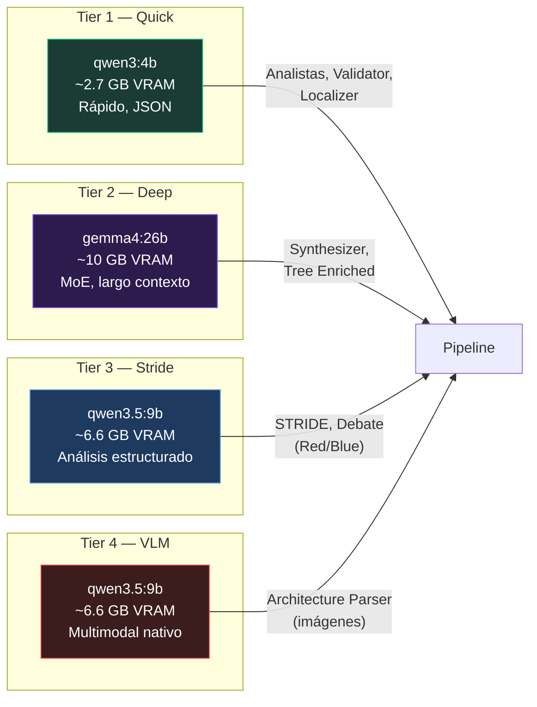

# 06 — Modelos LLM

> Arquitectura de 4 tiers, LLMFactory, 5 providers, y recomendaciones de hardware.

---

## Arquitectura de 4 Tiers

AgenticTM organiza sus modelos LLM en **4 tiers funcionales**, cada uno optimizado para un tipo de tarea:



### Detalle por Tier

| Tier | Config Key | Modelo Default | Parámetros | VRAM | Temperatura | Propósito |
|------|-----------|----------------|------------|------|-------------|-----------|
| **Quick** | `quick_thinker` | `qwen3:4b` | 4B | ~2.7 GB | 0.3 | Triage rápido, JSON estructurado |
| **Deep** | `deep_thinker` | `gemma4:26b` | 26B (MoE) | ~10 GB | 0.2 | Síntesis compleja, contexto largo (15-30K tokens) |
| **Stride** | `stride_thinker` | `qwen3.5:9b` | 9B | ~6.6 GB | 0.3 | Análisis STRIDE estructurado, debate |
| **VLM** | `vlm` | `qwen3.5:9b` | 9B + visión nativa | ~6.6 GB | 0.1 | Análisis de diagramas e imágenes |

### ¿Por Qué Esta Combinación?

El stack combina **Qwen3** (quick), **Qwen3.5** (stride/VLM) y **Gemma4** (deep):
- **Qwen3:4b** — rápido y ligero (~2.7 GB) para tareas de triage y JSON estructurado
- **Qwen3.5:9b** — multimodal nativo (texto + imágenes), contexto de 256K, ideal para STRIDE/debate/VLM
- **Gemma4:26b** — MoE con 3.8B params activos, 2.5x más rápido que modelos densos equivalentes, contexto 128-256K, ideal para síntesis profunda
- **Modo thinking configurable** — soporte nativo de `/think` y `/nothink` (deshabilitado por defecto para velocidad)

`_strip_think_tags()` en `base.py` limpia tags `<think>...</think>` del output cuando se usan modelos con modo reasoning.

---

## LLMFactory (`agentictm/llm/__init__.py`, 165 líneas)

### Propiedades Cacheadas

La factory crea y cachea 7 instancias de LLM:

```python
class LLMFactory:
    @property
    def quick(self) -> BaseChatModel:
        """LLM rápido para analistas (free-text)."""
        
    @property
    def quick_json(self) -> BaseChatModel:
        """LLM rápido con format=json."""
        
    @property
    def deep(self) -> BaseChatModel:
        """LLM deep para Synthesizer (free-text)."""
        
    @property
    def deep_json(self) -> BaseChatModel:
        """LLM deep con format=json."""
        
    @property
    def stride(self) -> BaseChatModel:
        """LLM CoT para STRIDE/debate (free-text)."""
        
    @property
    def stride_json(self) -> BaseChatModel:
        """LLM CoT con format=json."""
        
    @property
    def vlm(self) -> BaseChatModel:
        """Vision Language Model."""
```

Cada property usa `_get_or_create(key, cfg, format_override)` para crear la instancia una sola vez.

### `format_override="json"`

Para los tiers `*_json`, se pasa `format="json"` a Ollama, lo que fuerza al modelo a producir JSON válido. Esto es **significativamente más confiable** que depender del prompt para obtener JSON.

---

## 5 Providers Soportados

| Provider | Import | Config |
|----------|--------|--------|
| **Ollama** (default) | `langchain_ollama.ChatOllama` | `provider: "ollama"`, `base_url: "http://localhost:11434"` |
| **Anthropic** | `langchain_anthropic.ChatAnthropic` | `provider: "anthropic"`, `api_key: "sk-..."` |
| **Google** | `langchain_google_genai.ChatGoogleGenerativeAI` | `provider: "google"`, `api_key: "AIza..."` |
| **OpenAI** | `langchain_openai.ChatOpenAI` | `provider: "openai"`, `api_key: "sk-..."` |
| **Azure OpenAI** | `langchain_openai.AzureChatOpenAI` | `provider: "azure"`, `base_url: "https://xxx.openai.azure.com"`, `api_key: "..."` |

### Instalación de Providers Cloud

Los providers cloud son **dependencias opcionales**:

```bash
# Solo Ollama (default, ya incluido)
pip install .

# Con providers cloud
pip install ".[cloud]"
# Instala: langchain-anthropic, langchain-google-genai, langchain-openai
```

### Ejemplo: Configuración Híbrida

```json
{
  "quick_thinker": {
    "provider": "ollama",
    "model": "qwen3:4b",
    "base_url": "http://localhost:11434"
  },
  "deep_thinker": {
    "provider": "anthropic",
    "model": "claude-sonnet-4-20250514",
    "api_key": "sk-ant-..."
  },
  "stride_thinker": {
    "provider": "ollama",
    "model": "qwen3.5:9b",
    "base_url": "http://localhost:11434"
  },
  "vlm": {
    "provider": "google",
    "model": "gemini-2.0-flash",
    "api_key": "AIza..."
  }
}
```

En este ejemplo, los analistas rápidos corren local (Ollama), el Synthesizer usa Claude (Anthropic) y el VLM usa Gemini.

---

## Modelos Ollama Requeridos

### Descarga

```bash
# Requeridos
ollama pull qwen3:4b                  # Quick Thinker — ~2.7 GB download
ollama pull qwen3.5:9b                # Stride/VLM    — ~6.6 GB download
ollama pull gemma4:26b                # Deep Thinker  — ~10 GB download (MoE)
ollama pull nomic-embed-text-v2-moe   # Embeddings    — ~274 MB download (8K, multilingual)

# Total: ~20 GB de disco
```

### Verificación

```bash
# Ver modelos instalados
ollama list

# Probar un modelo
ollama run qwen3:4b "Hola, ¿funciona?"
```

### Control de GPU

El campo `num_gpu` controla cuántas capas se cargan en GPU:

```json
{
  "deep_thinker": {
    "model": "gemma4:26b",
    "num_gpu": -1    // -1 = todas las capas en GPU (100% VRAM)
  },
  "quick_thinker": {
    "model": "qwen3:4b",
    "num_gpu": null  // null = Ollama decide automáticamente
  }
}
```

| Valor | Significado |
|-------|-------------|
| `null` | Ollama decide automáticamente (default) |
| `-1` | Todas las capas en GPU (máxima velocidad, máxima VRAM) |
| `0` | Todas las capas en CPU (sin GPU, más lento) |
| `N > 0` | Exactamente N capas en GPU (rest en CPU) |

---

## Recomendaciones de Hardware

### GPU por Presupuesto

| VRAM | Configuración Recomendada |
|------|---------------------------|
| **8 GB** | `quick_thinker` = qwen3:4b, `deep_thinker` = qwen3:4b (sin diferenciación real), `max_parallel_analysts` = 1, `analyst_execution_mode` = cascade |
| **16 GB** | `quick_thinker` = qwen3:4b, `deep_thinker` = gemma4:26b, `stride_thinker` = qwen3.5:9b, `max_parallel_analysts` = 2, `analyst_execution_mode` = hybrid |
| **24 GB** | Mismo que 16 GB pero con `max_parallel_analysts` = 3 |
| **32+ GB** | Full parallel con todos los modelos diferenciados, `max_parallel_analysts` = 5 |

### Consumo Estimado por Fase

| Fase | Modelos Activos | VRAM Pico (hybrid, max=2) |
|------|----------------|---------------------------|
| I | quick_json + vlm (si hay imágenes) | ~9 GB |
| II | 2× quick_json (throttled) | ~5.4 GB |
| III | stride | ~6.6 GB |
| II.5 | deep_json | ~10 GB |
| IV | deep_json → quick_json | ~10 GB → ~2.7 GB |
| V | quick_json (localizer) | ~2.7 GB |

> **Nota**: Ollama gestiona la carga/descarga de modelos automáticamente. Cuando un modelo no se usa, Ollama lo puede descargar de VRAM para hacer espacio.

### Configuraciones Probadas

| Hardware | Tiempo típico (sistema mediano) | Config |
|----------|-------------------------------|--------|
| RTX 4090 (24 GB) | 15-25 min | hybrid, max=2, todos los modelos |
| RTX 3080 (10 GB) | 25-40 min | hybrid, max=1, quick=stride=qwen3:4b |
| Apple M2 Ultra (64 GB unified) | 10-20 min | hybrid, max=3, todos los modelos |
| CPU only (32 GB RAM) | 60-120 min | cascade, quick=deep=qwen3:4b |

---

## Timeouts

| Configuración | Default | Descripción |
|---------------|---------|-------------|
| `timeout` (por LLM) | 300s (quick), 600s (deep/stride/vlm) | HTTP client timeout para Ollama |
| `vlm_image_timeout` | 600s (quick), 1200s (vlm) | Per-image VLM timeout (imágenes grandes 6+ MB) |

Si un modelo tarda más que el timeout, la request falla y `_safe_node` maneja el error (degradación graciosa para nodos no-críticos).

---

*[← 05 — Sistema RAG](05_sistema_rag.md) · [07 — API y Frontend →](07_api_y_frontend.md)*
