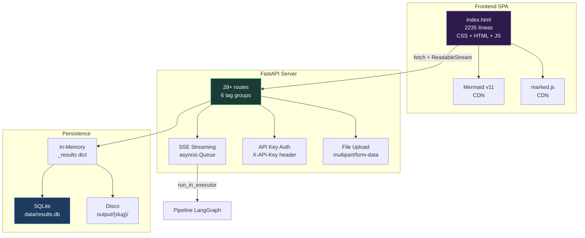
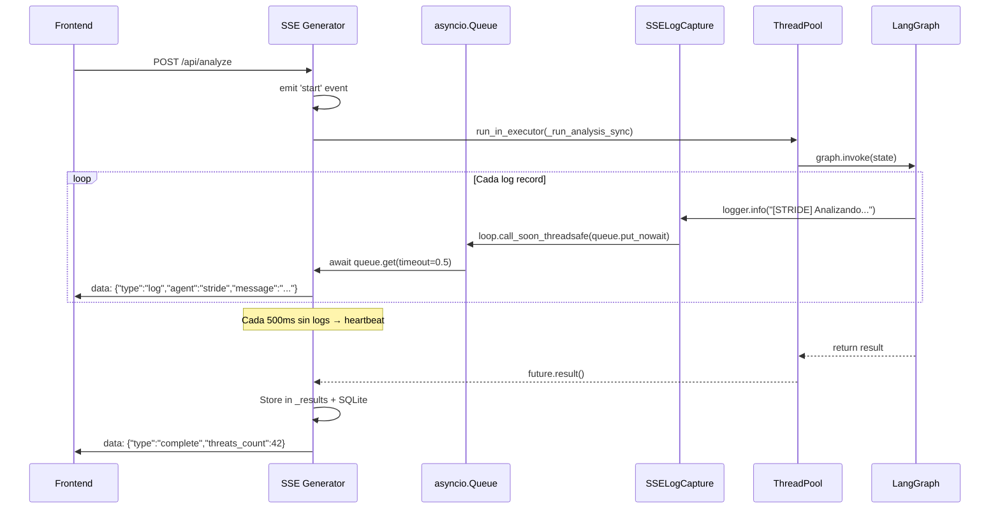
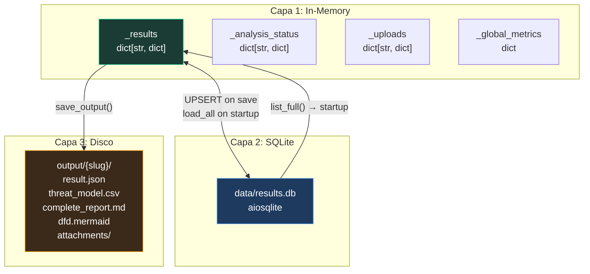
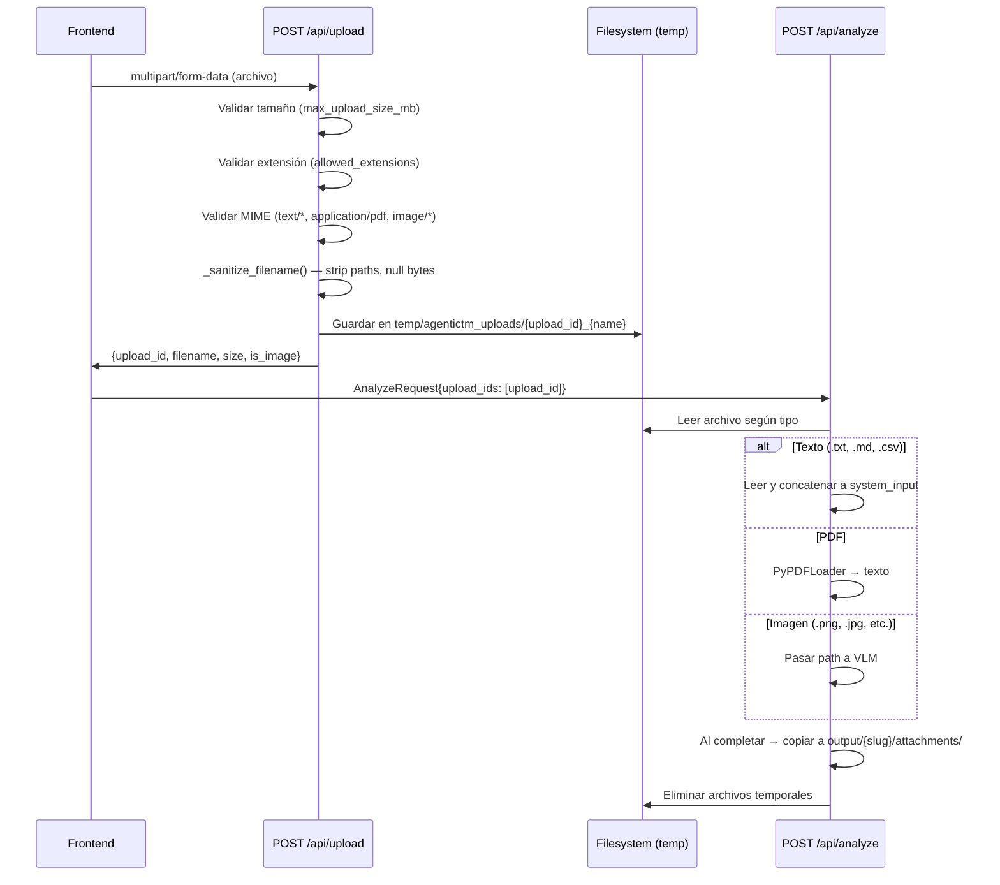
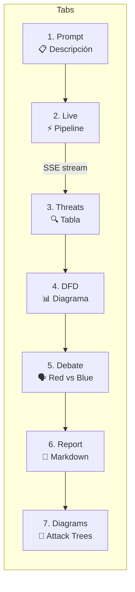
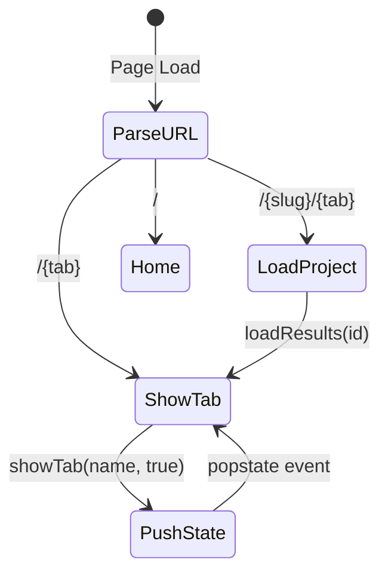
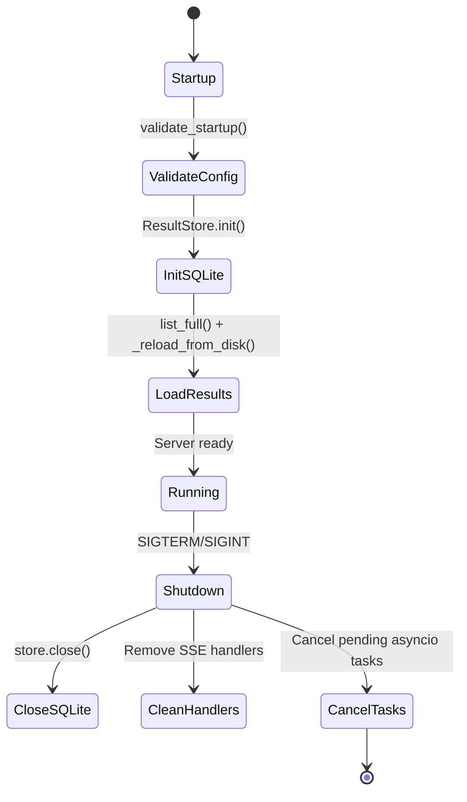
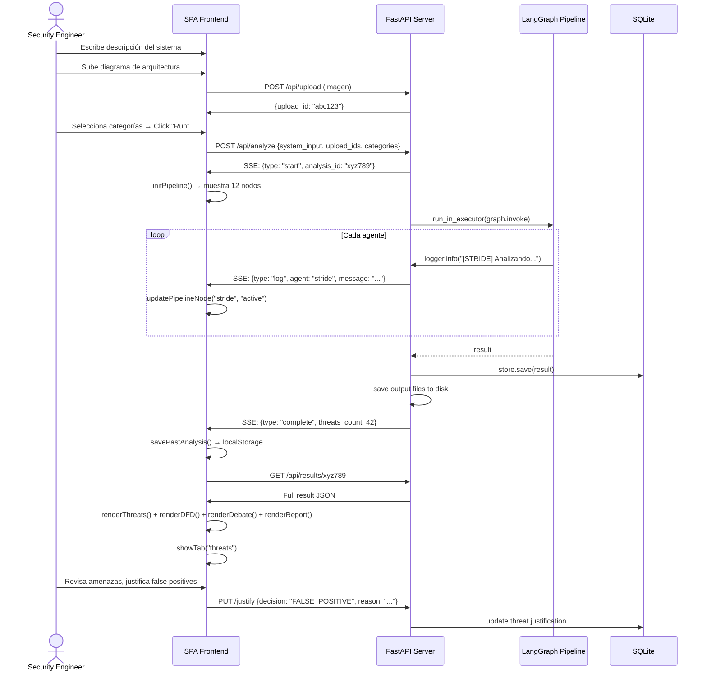

# 07 — API y Frontend

> FastAPI backend con SSE streaming, SPA frontend con dark theme, Mermaid y 7 tabs.

---

## Visión General

AgenticTM expone una **API REST** (FastAPI) y una **SPA** (Single-Page Application) embebida. El servidor maneja análisis asíncronos vía SSE, persiste resultados en SQLite + disco, y sirve una UI completa sin dependencias externas de build.



### Estructura del Paquete

| Archivo | Líneas | Descripción |
|---------|--------|-------------|
| `agentictm/api/server.py` | 1709 | FastAPI server: rutas, SSE, uploads, auth, CRUD, justificaciones |
| `agentictm/api/storage.py` | 157 | `ResultStore` — SQLite async con `aiosqlite` |
| `agentictm/api/__init__.py` | 2 | Docstring: `"""AgenticTM Web API — FastAPI backend con SSE streaming."""` |
| `agentictm/api/static/index.html` | 2235 | SPA completa — CSS + HTML + JS en un solo archivo |

---

## Rutas API — Referencia Completa

### Health (`tags=["Health"]`)

| Método | Path | Descripción | Auth | Response |
|--------|------|-------------|------|----------|
| `GET` | `/api/health` | Liveness probe | No | `{status, version, timestamp}` |
| `GET` | `/api/ready` | Readiness probe (verifica Ollama via `httpx`) | No | `{ready, ollama, timestamp}` o `503` |

### Analysis (`tags=["Analysis"]`)

| Método | Path | Descripción | Auth | Request | Response |
|--------|------|-------------|------|---------|----------|
| `POST` | `/api/analyze` | Inicia análisis (stream SSE) | Sí | `AnalyzeRequest` | `StreamingResponse` (SSE) |

**`AnalyzeRequest` — campos:**

| Campo | Tipo | Default | Descripción |
|-------|------|---------|-------------|
| `system_input` | `str` | requerido | Descripción del sistema |
| `system_name` | `str` | `"System"` | Nombre legible |
| `categories` | `list[str]` | `["auto"]` | Categorías de amenazas |
| `upload_ids` | `list[str]` | `[]` | IDs de archivos subidos |
| `max_debate_rounds` | `int` | `2` | Rondas de debate (1-9) |
| `cloud_providers` | `dict \| null` | `null` | Config de proveedor cloud (ver abajo) |

**`cloud_providers` — estructura:**

```json
{
  "gemini": {
    "enabled": true,
    "api_key": "AIza...",
    "quick_model": "gemini-2.5-pro",
    "deep_model": "gemini-2.5-pro",
    "provider": "google"
  }
}
```

Solo un provider puede estar habilitado por request. Si `cloud_providers` es `null` o todos están deshabilitados, se usa Ollama local.
| `POST` | `/api/upload` | Sube archivo para análisis | Sí | `multipart/form-data` | `{upload_id, filename, size, is_image}` |
| `GET` | `/api/categories` | Lista categorías disponibles | No | — | `CategoryInfo[]` (11 categorías) |
| `GET` | `/api/analysis/{id}/status` | Estado de análisis activo | No | — | `{analysis_id, status, system_name}` |
| `GET` | `/api/analyses/active` | Lista análisis activos/en cola | No | — | `{active[], count}` |

### Results (`tags=["Results"]`)

| Método | Path | Descripción | Auth | Response |
|--------|------|-------------|------|----------|
| `GET` | `/api/results` | Lista análisis completados (resumen) | No | `AnalysisSummaryResponse[]` |
| `GET` | `/api/results/{id}` | Resultado completo de un análisis | No | JSON con threats, DFD, debate, report, attack trees |
| `DELETE` | `/api/results/{id}` | Elimina análisis + archivos en disco | Sí | `{status, analysis_id, removed_output_dir}` |
| `GET` | `/api/results/{id}/csv` | Descarga CSV de amenazas | No | `text/csv` con BOM UTF-8 |
| `GET` | `/api/results/{id}/csv-justified` | CSV con columnas de justificación (21 cols) | No | `text/csv` |
| `GET` | `/api/results/{id}/report` | Descarga reporte Markdown | No | `text/markdown` |
| `GET` | `/api/results/{id}/latex` | Genera y descarga reporte LaTeX | No | `application/x-latex` |
| `GET` | `/api/results/{id}/attachments/{name}` | Descarga archivo adjunto persistido | No | `FileResponse` |
| `PUT` | `/api/results/{id}/threats/{tid}/justify` | Agrega/actualiza justificación | Sí | `{threat_id, decision, justified_at}` |
| `DELETE` | `/api/results/{id}/threats/{tid}/justify` | Elimina justificación | Sí | `{threat_id, message}` |
| `PUT` | `/api/results/{id}/threats/{tid}/field` | Actualiza campo de amenaza | Sí | `{threat_id, field, value}` |

### RAG Sources (`tags=["RAG"]`)

| Método | Path | Descripción | Auth | Response |
|--------|------|-------------|------|----------|
| `GET` | `/api/rag` | Lista documentos RAG con estado de indexación | No | `{rag_path, total, indexed, stores}` |
| `POST` | `/api/rag/upload` | Sube documento a RAG | Sí | `{filename, category, size_bytes}` |
| `DELETE` | `/api/rag/{cat}/{file}` | Elimina documento de RAG | Sí | `{deleted, category}` |
| `POST` | `/api/rag/reindex` | Dispara re-indexación | Sí | `{status, force, result}` |
| `GET` | `/api/rag/categories` | Categorías RAG con conteo de docs | No | `{categories[]}` |

### Observability (`tags=["Observability"]`)

| Método | Path | Descripción | Auth | Response |
|--------|------|-------------|------|----------|
| `GET` | `/api/metrics` | Dashboard global de observabilidad | No | `{global{total, completed, failed, avg_duration}, per_agent{...}}` |
| `GET` | `/api/results/{id}/metrics` | Métricas por análisis | No | `{analysis_id, agent_metrics, threats_count}` |

### SPA Routes

| Método | Path | Descripción |
|--------|------|-------------|
| `GET` | `/` | Root — sirve SPA |
| `GET` | `/home`, `/prompt`, `/live`, `/threats`, `/dfd`, `/debate`, `/report`, `/diagrams` | Rutas de tabs |
| `GET` | `/{project_slug}/{tab}` | Rutas con scope de proyecto |
| Static | `/static/*` | Archivos estáticos |

---

## SSE Streaming — Implementación Detallada

### Puente Queue-Based

El pipeline LangGraph corre **sincrónicamente** en un thread pool. Un `logging.Handler` custom conecta los logs del pipeline con el stream SSE asíncrono.



### Tipos de Eventos SSE

| Tipo | Campos | Cuándo |
|------|--------|--------|
| `start` | `analysis_id, system_name, categories, timestamp` | Análisis comienza |
| `log` | `level, message, agent, timestamp` | Cada log record del pipeline |
| `heartbeat` | `type` | Cada 500ms sin actividad (keep-alive) |
| `complete` | `analysis_id, threats_count, categories, timestamp` | Pipeline exitoso |
| `error` | `message, traceback, timestamp` | Excepción en pipeline |

### Extracción de Nombre de Agente

`_extract_agent_name()` mapea 20+ marcadores de log a nombres canónicos:

| Marcador en Log | Nombre Canónico |
|-----------------|-----------------|
| `[STRIDE]` | `stride` |
| `[Red Team]` | `red_team` |
| `[Blue Team]` | `blue_team` |
| `[Architecture]` | `architecture_parser` |
| `[Synthesizer]` | `threat_synthesizer` |
| `[DREAD]` | `dread_validator` |
| `[Localizer]` | `output_localizer` |
| `[Report]` | `report_generator` |
| ... | ... |

### Headers SSE

```http
Content-Type: text/event-stream
Cache-Control: no-cache
Connection: keep-alive
X-Accel-Buffering: no    # Bypass nginx buffering
```

---

## Autenticación

| Aspecto | Detalle |
|---------|---------|
| **Header** | `X-API-Key` |
| **Dependency** | `verify_api_key()` — FastAPI `Depends()` |
| **Sin key configurada** | Auth **deshabilitada** (todos pasan) |
| **Con key** | Header debe coincidir exactamente → `401` con `WWW-Authenticate: ApiKey` |
| **Rutas protegidas** | `POST /api/analyze`, `POST /api/upload`, `DELETE /api/results/*`, `PUT */justify`, `DELETE */justify`, `PUT */field`, KB upload/delete/reindex |
| **Rutas públicas** | Health, categories, GET results, CSV/report downloads, metrics |

Configuración en `config.json`:

```json
{
  "security": {
    "api_key": "mi-clave-secreta"
  }
}
```

O via variable de entorno:

```bash
set AGENTICTM_API_KEY=mi-clave-secreta
```

---

## Persistencia — 3 Capas



### SQLite — Schema

```sql
CREATE TABLE results (
    analysis_id   TEXT PRIMARY KEY,
    system_name   TEXT NOT NULL DEFAULT '',
    created_at    TEXT NOT NULL,
    updated_at    TEXT NOT NULL,
    output_dir    TEXT DEFAULT '',
    result_json   TEXT NOT NULL   -- JSON blob completo
);
CREATE INDEX idx_results_created ON results(created_at DESC);
```

### Operaciones `ResultStore`

| Método | SQL | Descripción |
|--------|-----|-------------|
| `save()` | `INSERT OR REPLACE` | UPSERT — actualizaciones reescriben todo el JSON |
| `get(id)` | `SELECT … WHERE analysis_id = ?` | Un resultado por ID |
| `list_all()` | `SELECT` (sin `result_json`) | Solo metadata para listados |
| `list_full()` | `SELECT *` | Todo — usado al startup para hidratar `_results` |
| `delete(id)` | `DELETE WHERE analysis_id = ?` | Elimina registro |
| `count()` | `SELECT COUNT(*)` | Total de análisis |

### Disco — Estructura por Análisis

```
output/
└── mi-sistema-24-02-2026-2130/
    ├── result.json               # Resultado completo (JSON)
    ├── threat_model.csv          # 16 columnas
    ├── complete_report.md        # Reporte Markdown
    ├── dfd.mermaid               # Código Mermaid del DFD
    └── attachments/
        ├── architecture.png      # Diagrama subido
        └── rfc-specs.pdf         # Documento subido
```

### Ciclo de Vida al Startup

1. `await _store.init()` — crea tabla si no existe
2. `_store.list_full()` — carga todos los resultados de SQLite
3. `_reload_results_from_disk()` — busca `output/*/result.json` para resultados legacy no en SQLite
4. `_build_legacy_result()` — reconstruye resultado desde CSV + report + DFD para directorios legacy sin `result.json`

---

## Manejo de Uploads

### Flujo Completo



### Validaciones

| Validación | Configuración | Default |
|------------|---------------|---------|
| Tamaño máximo | `security.max_upload_size_mb` | 10 MB |
| Extensiones permitidas | `security.allowed_extensions` | `.txt, .md, .csv, .json, .pdf, .png, .jpg, ...` |
| MIME prefixes | hardcoded | `text/`, `application/pdf`, `image/` |
| Sanitización de nombre | `_sanitize_filename()` | Strip path, nulls, `..` consecutivos |

---

## Frontend SPA

### 7 Tabs



#### Tab 1 — Prompt

Muestra el input del análisis:
- Texto de descripción del sistema
- Archivos adjuntos (chips con links de descarga)
- Categorías activas
- Output del Architecture Parser

#### Tab 2 — Live Execution

Ejecución en tiempo real:
- **Pipeline bar**: 12 nodos con animaciones `active` (pulsing) y `done` (verde)
- **Thinking stream**: bloques colapsables por agente, cada uno con dot de color único
- Auto-scroll al último mensaje

#### Tab 3 — Threats

Tabla profesional de amenazas:
- Agrupadas en **7 categorías semánticas** (por prefijo de ID: INF-, PRI-, WEB-, AGE-, LLM-, HUM-, TM-)
- **16 columnas**: ID, Description, STRIDE, Control, D/R/E/A/D scores, DREAD avg, Priority, Estado, Tratamiento, Confidence, Evidence, Justification
- **Dropdowns inline**: Estado (Implementado / No Implementado / No Aplica), Tratamiento (Aceptar / Rechazar / Transferir / No Aplica)
- **Badges**: Confidence (high → verde, medium → amarillo, low → rojo)
- **Evidence tooltip**: hover muestra sources detectadas
- **Justification modal**: decisión + razón (mín. 50 chars) + justified_by
- **Botones de descarga**: CSV, CSV Justified, Report (.md), LaTeX (.tex)

#### Tab 4 — DFD

Data Flow Diagram renderizado con Mermaid v11. Click para hacer zoom.

#### Tab 5 — Debate

Red Team vs Blue Team:
- Entries estilizadas rojo/azul (`.debate-entry.red`, `.debate-entry.blue`)
- **Dos modos de rendering**:
  1. **Markdown**: limpia `<think>` blocks, señales de convergencia → `marked.parse()`
  2. **JSON estructurado**: detecta `{` o `[` → cards para `threat_assessments`, `attack_chains`, `security_assumptions_challenged`

#### Tab 6 — Report

Reporte Markdown completo:
- Renderizado con `marked.js` (`breaks: true`, `gfm: true`)
- Code blocks `mermaid` embebidos auto-renderizados
- Action bar: Print/PDF, Download .md, Download .tex

#### Tab 7 — Diagrams

Todos los diagramas Mermaid en un panel:
- DFD
- Attack Trees iniciales (Fase II)
- Attack Trees enriquecidos (Fase II.5)
- Cada uno con label del root goal

---

### Routing — URLs Navegables



| Función | Propósito |
|---------|-----------|
| `parseProjectRoute(pathname)` | Parsea `/{slug}/{tab}` o `/{tab}` |
| `buildTabPath(tabName)` | Construye URL con slug de proyecto si existe |
| `showTab(name, pushState)` | Cambia tab activo + `history.pushState()` |
| `handleInitialRoute()` | IIFE al cargar — parsea URL y carga proyecto/tab correctos |

#### URLs Ejemplo

```
/                                    → Home (nueva análisis)
/threats                             → Tab threats (último análisis)
/mi-sistema-24-02-2026-2130/threats   → Proyecto específico, tab threats
/mi-sistema-24-02-2026-2130/debate    → Proyecto específico, tab debate
```

---

### SSE en el Cliente

El frontend **no usa `EventSource`** — usa `fetch()` con `ReadableStream` para mayor control:

```javascript
// Pseudocódigo simplificado
const res = await fetch('/api/analyze', { method: 'POST', body: JSON.stringify(req) });
const reader = res.body.getReader();
const decoder = new TextDecoder();

let buffer = '';
while (true) {
    const { value, done } = await reader.read();
    if (done) break;
    buffer += decoder.decode(value, { stream: true });
    
    // Separar por doble newline (protocolo SSE)
    const events = buffer.split('\n\n');
    buffer = events.pop();  // último chunk incompleto
    
    for (const block of events) {
        const dataLine = block.split('\n').find(l => l.startsWith('data: '));
        if (dataLine) {
            const event = JSON.parse(dataLine.slice(6));
            handleEvent(event);
        }
    }
}
```

### Funciones JS Principales

| Función | Propósito |
|---------|-----------|
| `changeDebateRounds(delta)` | Incrementa/decrementa `_debateRounds` (rango 1-9, default 2) |
| `toggleApiKeysPanel()` | Muestra/oculta el panel de API keys |
| `onProviderToggle(provider)` | Activa provider cloud (desactiva los demás), llama `saveApiKeys()` |
| `onApiKeyInput(provider)` | Guarda key en `localStorage` al tipear |
| `saveApiKeys()` | Persiste `{enabled, key}` en `localStorage["agentictm_api_keys"]` |
| `loadApiKeys()` | Restaura keys y estado de toggles al cargar la página |
| `toggleKeyVisibility(inputId, btn)` | Toggle password/text en campo de API key |
| `buildCloudProviders()` | Construye el dict `cloud_providers` para el body del request |
| `updateApiInfoRow()` | Actualiza el pill de info dentro del panel |
| `updateLimitsInfo()` | Actualiza el badge `#activeModelInfo` en la barra inferior |
| `startAnalysis()` | Valida input, limpia panels via `_clearResultPanels()`, POST + lee stream SSE |
| `handleEvent(event)` | Dispatcher SSE: `start` → setea ID; `log` → `addThinkingEntry()`; `complete` → `loadResults()` |
| `loadResults(id)` | Fetch `/api/results/{id}`, actualiza sidebar, llama render functions, muestra tab `threats` |
| `_clearResultPanels()` | Reset 7 panels a estado "waiting" antes de nuevo análisis |
| `renderThreats(threats)` | Tabla agrupada en 7 categorías, dropdowns, badges, modales |
| `renderDFD(mermaid)` | Renderiza DFD via `renderMermaidChart()` |
| `renderDebate(debate)` | Red/Blue entries con markdown o JSON |
| `renderReport(report)` | Markdown via `marked.parse()`, auto-render mermaid embebido |
| `renderDiagrams(trees, dfd)` | DFD + attack trees iniciales + enriquecidos |
| `initPipeline()` | Crea pipeline bar de 12 nodos |
| `addThinkingEntry(event)` | Agrega log a bloque colapsable del agente |

---

### Modales

#### Modal de Justificación

Permite al security engineer documentar decisiones sobre cada amenaza:

| Campo | Tipo | Requerido | Opciones |
|-------|------|-----------|----------|
| **Decision** | Select | Sí | `FALSE_POSITIVE`, `MITIGATED_BY_INFRA`, `ACCEPTED_RISK`, `NOT_APPLICABLE` |
| **Reason** | Textarea | Sí (mín. 50 chars) | Texto libre |
| **Justified By** | Input | No | Nombre/email del responsable |
| **Context Snapshot** | Automático | — | Snapshot del estado actual de la amenaza |

#### Modal de Evidencia

| Sección | Editable | Contenido |
|---------|----------|-----------|
| **Evidence Sources** | No (read-only) | Auto-detectadas: `source_type`, `source_name`, `excerpt` |
| **Evidence Notes** | Sí (textarea) | Notas manuales del analista |

---

### Análisis Pasados — localStorage

```javascript
// Estructura en localStorage
key: "agentictm_past_analyses"
value: [
    {
        "id": "ab12cd34-...",
        "name": "Mi Sistema",
        "threats": 42,
        "timestamp": "2026-02-24T21:30:00Z"
    },
    // ... máximo 50 items
]
```

| Función | Propósito |
|---------|-----------|
| `savePastAnalysis(id, name, threats)` | Guarda en localStorage (max 50 items) |
| `syncPastAnalyses()` | Merge datos del servidor (`/api/results`) con localStorage |
| `renderPastAnalyses()` | Render lista en sidebar con botones delete |
| `loadProjectFromSidebar(project, tab)` | Carga análisis pasado, switch al tab indicado |

---

### Dark Theme

| Variable CSS | Valor | Uso |
|--------------|-------|-----|
| `--bg` | `#0f0f0f` | Fondo principal |
| `--bg2` | `#1a1a1a` | Fondo de panels |
| `--bg3` | `#242424` | Fondo de inputs |
| `--border` | `#333` | Bordes |
| `--text` | `#e0e0e0` | Texto principal |
| `--accent` | `#a773bf` | Color de acento (purple) |
| `--success` | `#10b981` | Estados ok |
| `--danger` | `#ef4444` | Errores |

Features adicionales:
- **Gradient en título** del landing
- **Dot colors** únicos por agente (12 colores)
- **Print styles**: `@media print` → fondo blanco, oculta sidebar/topbar
- **Responsive**: `@media (max-width: 768px)` → sidebar como overlay fijo
- **Scrollbars custom**: thin, dark

---

### Dependencias CDN

| Librería | Versión | Uso |
|----------|---------|-----|
| **Mermaid** | v11 | Diagramas DFD, Attack Trees |
| **marked.js** | Latest | Render Markdown (report, debate) |

Configuración Mermaid:

```javascript
mermaid.initialize({
    startOnLoad: false,
    theme: 'dark',
    securityLevel: 'loose',
    themeVariables: {
        // Custom palette matching app dark theme
    }
});
```

---

## Middleware y Lifecycle

### CORS

```python
app.add_middleware(
    CORSMiddleware,
    allow_origins=["*"],
    allow_methods=["*"],
    allow_headers=["*"],
    allow_credentials=True,
)
```

### Lifespan Events



---

## Métricas de Observabilidad

### `GET /api/metrics` — Dashboard Global

```json
{
  "global": {
    "total_analyses": 15,
    "completed": 12,
    "failed": 3,
    "average_duration_seconds": 1245.7,
    "stored_results": 12
  },
  "per_agent": {
    "architecture_parser": {
      "invocations": 12,
      "avg_duration_seconds": 45.2,
      "tool_calls": 24,
      "reflections": 3,
      "errors": 0
    },
    "stride_analyst": { ... },
    "red_team": { ... }
  },
  "timestamp": "2026-02-24T21:30:00Z"
}
```

### `GET /api/results/{id}/metrics` — Por Análisis

```json
{
  "analysis_id": "ab12cd34-...",
  "agent_metrics": {
    "architecture_parser": { "duration": 52.1, "tool_calls": 3, "reflections": 1 },
    "stride_analyst": { "duration": 120.5, "tool_calls": 0, "reflections": 0 }
  },
  "threats_count": 42,
  "justified_count": 5
}
```

---

## Ejemplo: Flujo Completo de Análisis



---

*[← 06 — Modelos LLM](06_modelos_llm.md) · [08 — Configuración →](08_configuracion.md)*
