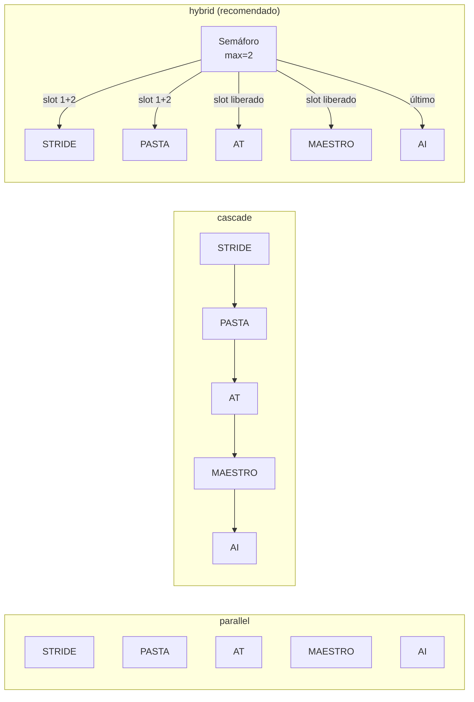
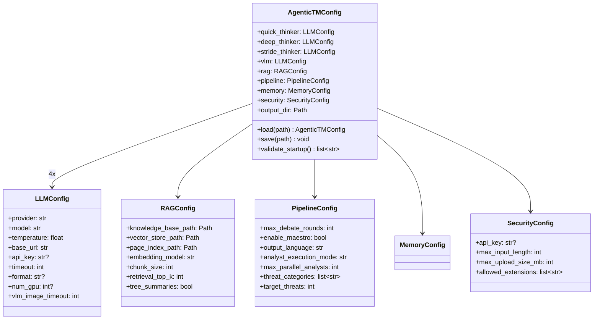
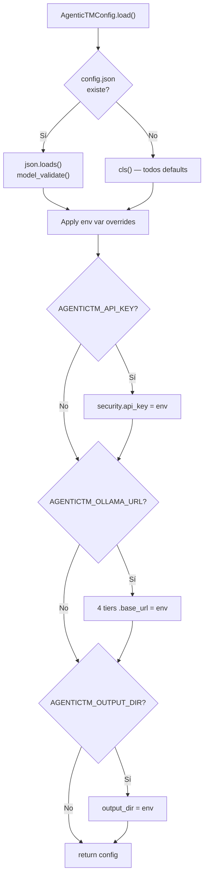

# 08 — Configuración

> Referencia completa de `config.json`, variables de entorno, y modelos Pydantic.

---

## Archivo `config.json`

El archivo `config.json` en la raíz del proyecto controla toda la configuración de AgenticTM. Se carga al inicio via `AgenticTMConfig.load()`.

### Estructura Completa (con defaults)

```json
{
  "quick_thinker": {
    "provider": "ollama",
    "model": "qwen3:8b",
    "temperature": 0.3,
    "base_url": "http://localhost:11434",
    "api_key": null,
    "timeout": 300,
    "format": null,
    "num_gpu": null,
    "vlm_image_timeout": 600
  },
  "deep_thinker": {
    "provider": "ollama",
    "model": "qwen3:30b-a3b",
    "temperature": 0.2,
    "base_url": "http://localhost:11434",
    "api_key": null,
    "timeout": 600,
    "num_gpu": -1
  },
  "stride_thinker": {
    "provider": "ollama",
    "model": "deepseek-r1:14b",
    "temperature": 0.3,
    "base_url": "http://localhost:11434",
    "api_key": null,
    "timeout": 600,
    "num_gpu": -1
  },
  "vlm": {
    "provider": "ollama",
    "model": "qwen3-vl:8b",
    "temperature": 0.1,
    "base_url": "http://localhost:11434",
    "api_key": null,
    "timeout": 600,
    "vlm_image_timeout": 1200,
    "num_gpu": -1
  },
  "rag": {
    "knowledge_base_path": "knowledge_base",
    "vector_store_path": "data/vector_stores",
    "page_index_path": "data/page_indices",
    "embedding_provider": "ollama",
    "embedding_model": "nomic-embed-text",
    "chunk_size": 1000,
    "chunk_overlap": 200,
    "retrieval_top_k": 5,
    "tree_summaries": true,
    "max_summary_nodes": 50
  },
  "pipeline": {
    "max_debate_rounds": 2,
    "max_validation_iterations": 2,
    "enable_maestro": true,
    "output_format": "both",
    "output_language": "es",
    "csv_schema": "auto",
    "self_reflection_enabled": false,
    "self_reflection_rounds": 1,
    "min_threats": 8,
    "max_threats": 40,
    "target_threats": 20,
    "threat_categories": ["auto"],
    "analyst_execution_mode": "hybrid",
    "max_parallel_analysts": 2
  },
  "memory": {
    "enabled": true,
    "db_path": "data/memory.db",
    "journal_path": "data/journal.db"
  },
  "security": {
    "api_key": null,
    "max_input_length": 100000,
    "max_upload_size_mb": 10,
    "allowed_extensions": [
      ".txt", ".md", ".pdf", ".doc", ".docx", ".csv", ".json",
      ".yaml", ".yml", ".png", ".jpg", ".jpeg", ".gif",
      ".bmp", ".webp", ".svg", ".tiff"
    ]
  },
  "output_dir": "output"
}
```

---

## Referencia por Sección

### `LLMConfig` — Configuración de Modelos

Aplica a cada uno de los 4 tiers: `quick_thinker`, `deep_thinker`, `stride_thinker`, `vlm`.

| Campo | Tipo | Default | Descripción |
|-------|------|---------|-------------|
| `provider` | `str` | `"ollama"` | Provider LLM: `ollama`, `anthropic`, `google`, `openai`, `azure` |
| `model` | `str` | Varía por tier | Nombre del modelo (e.g., `qwen3:8b`, `claude-sonnet-4-20250514`) |
| `temperature` | `float` | 0.3 (quick/stride), 0.2 (deep), 0.1 (vlm) | Temperatura de sampling (0.0 = determinístico, 1.0 = creativo) |
| `base_url` | `str` | `"http://localhost:11434"` | URL base del provider (Ollama, Azure) |
| `api_key` | `str \| None` | `null` | API key para providers cloud |
| `timeout` | `int` | 300 (quick) / 600 (deep/stride/vlm) | HTTP client timeout en segundos |
| `format` | `str \| None` | `null` | `"json"` para forzar JSON output (usado internamente por LLMFactory) |
| `num_gpu` | `int \| None` | `null` / `-1` | Capas en GPU: `null`=auto, `-1`=todas, `0`=CPU, `N`=N capas |
| `vlm_image_timeout` | `int` | 600 / 1200 | Timeout per-image para VLM (imágenes grandes) |

### `RAGConfig` — Sistema RAG

| Campo | Tipo | Default | Descripción |
|-------|------|---------|-------------|
| `knowledge_base_path` | `Path` | `knowledge_base` | Directorio con documentos KB |
| `vector_store_path` | `Path` | `data/vector_stores` | Directorio ChromaDB |
| `page_index_path` | `Path` | `data/page_indices` | Directorio JSON tree indices |
| `embedding_provider` | `str` | `"ollama"` | Provider de embeddings |
| `embedding_model` | `str` | `"nomic-embed-text"` | Modelo de embeddings |
| `chunk_size` | `int` | `1000` | Tamaño de chunks (caracteres) |
| `chunk_overlap` | `int` | `200` | Overlap entre chunks |
| `retrieval_top_k` | `int` | `5` | Resultados por query |
| `tree_summaries` | `bool` | `true` | Generar resúmenes LLM para nodos del tree |
| `max_summary_nodes` | `int` | `50` | Máximo nodos a resumir por PDF |

### `PipelineConfig` — Pipeline de Análisis

| Campo | Tipo | Default | Descripción |
|-------|------|---------|-------------|
| `max_debate_rounds` | `int` | `2` | Máximo rounds de debate (puede terminar antes por convergencia) |
| `max_validation_iterations` | `int` | `2` | Iteraciones de validación DREAD |
| `enable_maestro` | `bool` | `true` | Habilita MAESTRO (solo se activa si el sistema tiene AI) |
| `output_format` | `str` | `"both"` | Output: `"csv"`, `"markdown"`, `"both"` |
| `output_language` | `str` | `"es"` | Idioma de salida: `"es"` (español), `"en"` (inglés) |
| `csv_schema` | `str` | `"auto"` | Schema CSV: `"auto"` (detectar de previos) o `"default"` |
| `self_reflection_enabled` | `bool` | `false` | Agentes critican y revisan su propio output |
| `self_reflection_rounds` | `int` | `1` | Ciclos de critique→revise (0 = deshabilitado) |
| `min_threats` | `int` | `8` | Mínimo amenazas esperadas del Synthesizer |
| `max_threats` | `int` | `40` | Máximo antes de dedup agresivo |
| `target_threats` | `int` | `20` | Target ideal para el prompt del Synthesizer |
| `threat_categories` | `list[str]` | `["auto"]` | Categorías de amenazas a activar |
| `analyst_execution_mode` | `str` | `"hybrid"` | Modo ejecución: `"parallel"`, `"cascade"`, `"hybrid"` |
| `max_parallel_analysts` | `int` | `2` | Máximo LLM calls simultáneas de analistas (1-5) |

#### Categorías de Amenazas Disponibles

| Categoría | Descripción | KB Directory |
|-----------|-------------|--------------|
| `"auto"` | Auto-detectar del input (heurística de keywords) | — |
| `"base"` | Siempre incluida — STRIDE, DREAD, general | `risks_mitigations/base/` |
| `"aws"` | Amenazas específicas de AWS | `risks_mitigations/aws/` |
| `"azure"` | Amenazas específicas de Azure | `risks_mitigations/azure/` |
| `"gcp"` | Amenazas específicas de Google Cloud | `risks_mitigations/gcp/` |
| `"ai"` | AI/ML threats, OWASP LLM, MAESTRO | `risks_mitigations/ai/` |
| `"mobile"` | Amenazas de apps móviles | `risks_mitigations/mobile/` |
| `"web"` | Amenazas web, OWASP Top 10 | `risks_mitigations/web/` |
| `"iot"` | Amenazas IoT/embedded | `risks_mitigations/iot/` |
| `"privacy"` | Privacidad, GDPR, PLOT4ai | `risks_mitigations/privacy/` |
| `"supply_chain"` | Supply chain attacks | `risks_mitigations/supply_chain/` |

#### Modos de Ejecución de Analistas



### `MemoryConfig` — Memoria Persistente

| Campo | Tipo | Default | Descripción |
|-------|------|---------|-------------|
| `enabled` | `bool` | `true` | Habilitar memoria persistente |
| `db_path` | `Path` | `data/memory.db` | SQLite para memoria de sesión |
| `journal_path` | `Path` | `data/journal.db` | SQLite para journal de decisiones |

### `SecurityConfig` — Seguridad API

| Campo | Tipo | Default | Descripción |
|-------|------|---------|-------------|
| `api_key` | `str \| None` | `null` | API key. `null` o `""` = auth deshabilitada |
| `max_input_length` | `int` | `100000` | Máximo chars para descripción del sistema |
| `max_upload_size_mb` | `int` | `10` | Máximo tamaño de upload en MB |
| `allowed_extensions` | `list[str]` | 17 extensiones | Extensiones de archivo permitidas para upload |

---

## Variables de Entorno

Las variables de entorno **tienen precedencia** sobre `config.json`:

| Variable | Sección | Efecto |
|----------|---------|--------|
| `AGENTICTM_API_KEY` | `security.api_key` | Setea la API key de autenticación |
| `AGENTICTM_OLLAMA_URL` | `*.base_url` (4 tiers) | Cambia la URL de Ollama para **todos** los tiers |
| `AGENTICTM_OUTPUT_DIR` | `output_dir` | Directorio de salida |
| `AGENTICTM_MAX_INPUT_LENGTH` | `security.max_input_length` | Máximo chars de input |
| `AGENTICTM_MAX_UPLOAD_MB` | `security.max_upload_size_mb` | Máximo MB de upload |

### Ejemplo

```bash
# Windows cmd
set AGENTICTM_API_KEY=mi-clave-secreta-123
set AGENTICTM_OLLAMA_URL=http://192.168.1.100:11434
set AGENTICTM_OUTPUT_DIR=D:\resultados

# PowerShell
$env:AGENTICTM_API_KEY = "mi-clave-secreta-123"
$env:AGENTICTM_OLLAMA_URL = "http://192.168.1.100:11434"

# Linux/macOS
export AGENTICTM_API_KEY="mi-clave-secreta-123"
export AGENTICTM_OLLAMA_URL="http://192.168.1.100:11434"
```

---

## Modelos Pydantic

### Jerarquía de Clases



### Flujo de Carga



---

## `validate_startup()` — Validación al Inicio

Se ejecuta al iniciar el servidor o CLI. Retorna warnings (no fatales) y crea directorios faltantes.

### Checks Realizados

| Check | Acción si falla |
|-------|-----------------|
| `knowledge_base_path` existe | Crea directorio |
| `vector_store_path` existe | Crea directorio |
| `page_index_path` existe | Crea directorio |
| `output_dir` existe | Crea directorio |
| Ollama accesible | Warning en log |
| Cada modelo disponible en Ollama | Warning con lista de modelos disponibles |
| `security.api_key` configurada | Warning: "endpoints are unprotected" |
| Vector stores presentes | Info: conteo |
| Tree indices presentes | Info: conteo |

### Ejemplo de Output

```
  ✓ Ollama connected at http://localhost:11434 (5 models available)
    ✓ quick_thinker: qwen3:8b
    ✓ deep_thinker: qwen3:30b-a3b
    ✓ stride_thinker: qwen3:8b
    ✗ vlm: qwen3-vl:8b NOT FOUND
  ⚠ No API key configured — endpoints are unprotected
  ✓ 5 vector stores found
  ✓ 14 tree indices found
```

---

## Configuración para Docker

En Docker, las variables de entorno son el método preferido:

```yaml
# docker-compose.yml
services:
  app:
    environment:
      - AGENTICTM_OLLAMA_URL=http://ollama:11434
      - AGENTICTM_API_KEY=${API_KEY:-}
      - AGENTICTM_OUTPUT_DIR=/app/output
    volumes:
      - ./config.json:/app/config.json:ro
      - ./output:/app/output
      - ./knowledge_base:/app/knowledge_base:ro
```

---

## Configuraciones Recomendadas

### Computadora Personal (16 GB VRAM)

```json
{
  "quick_thinker": { "model": "qwen3:8b" },
  "deep_thinker": { "model": "qwen3:30b-a3b", "num_gpu": -1 },
  "stride_thinker": { "model": "qwen3:8b" },
  "vlm": { "model": "qwen3-vl:8b" },
  "pipeline": {
    "analyst_execution_mode": "hybrid",
    "max_parallel_analysts": 2,
    "max_debate_rounds": 4
  }
}
```

### Servidor GPU (32+ GB VRAM)

```json
{
  "quick_thinker": { "model": "qwen3:8b" },
  "deep_thinker": { "model": "qwen3:30b-a3b", "num_gpu": -1 },
  "stride_thinker": { "model": "deepseek-r1:14b", "num_gpu": -1 },
  "vlm": { "model": "qwen3-vl:8b", "num_gpu": -1 },
  "pipeline": {
    "analyst_execution_mode": "parallel",
    "max_parallel_analysts": 5,
    "max_debate_rounds": 8
  }
}
```

### Cloud Híbrido (GPU local + APIs)

```json
{
  "quick_thinker": { "provider": "ollama", "model": "qwen3:8b" },
  "deep_thinker": { "provider": "anthropic", "model": "claude-sonnet-4-20250514", "api_key": "sk-ant-..." },
  "stride_thinker": { "provider": "ollama", "model": "deepseek-r1:14b" },
  "vlm": { "provider": "google", "model": "gemini-2.0-flash", "api_key": "AIza..." },
  "pipeline": {
    "analyst_execution_mode": "parallel",
    "max_parallel_analysts": 5
  }
}
```

### Solo CPU (sin GPU)

```json
{
  "quick_thinker": { "model": "qwen3:4b", "num_gpu": 0 },
  "deep_thinker": { "model": "qwen3:8b", "num_gpu": 0 },
  "stride_thinker": { "model": "qwen3:4b", "num_gpu": 0 },
  "vlm": { "model": "qwen3-vl:4b", "num_gpu": 0 },
  "pipeline": {
    "analyst_execution_mode": "cascade",
    "max_parallel_analysts": 1,
    "max_debate_rounds": 2
  }
}
```

---

*[← 07 — API y Frontend](07_api_y_frontend.md) · [09 — Guía de Uso →](09_guia_de_uso.md)*
