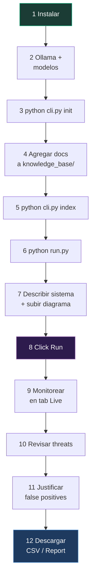

# 09 — Guía de Uso

> Instalación paso a paso, CLI, interfaz web, Docker, y flujo completo de análisis.

---

## Requisitos Previos

### Hardware Mínimo

| Componente | Mínimo | Recomendado |
|------------|--------|-------------|
| **RAM** | 16 GB | 32 GB |
| **GPU VRAM** | 8 GB (opciones limitadas) | 16-24 GB (NVIDIA) |
| **Disco** | 50 GB libres | 100 GB (modelos + KB) |
| **CPU** | 4 cores | 8+ cores |

### Software

| Dependencia | Versión | URL |
|-------------|---------|-----|
| **Python** | ≥ 3.11 | https://python.org |
| **Ollama** | ≥ 0.3.0 | https://ollama.com |
| **Git** | Cualquiera | https://git-scm.com |
| **Docker** (opcional) | ≥ 24.0 | https://docker.com |

---

## Instalación

### 1. Clonar el Repositorio

```bash
git clone https://github.com/your-org/AgenticTM.git
cd AgenticTM
```

### 2. Crear Entorno Virtual

```bash
# Windows
python -m venv .venv
.venv\Scripts\activate

# Linux / macOS
python3 -m venv .venv
source .venv/bin/activate
```

### 3. Instalar Dependencias

```bash
# Instalación básica (solo Ollama como provider)
pip install -e .

# O con requirements.txt (versiones pinneadas)
pip install -r requirements.txt
```

### 4. Instalar Ollama y Modelos

```bash
# Instalar Ollama (Windows: descargar desde https://ollama.com)
# Linux:
curl -fsSL https://ollama.com/install.sh | sh

# Descargar modelos (puede tardar según la conexión)
ollama pull qwen3:4b                  # Quick Thinker — ~2.7 GB
ollama pull qwen3.5:9b                # Deep + STRIDE/Debate/VLM — ~6.6 GB (9B)
ollama pull nomic-embed-text-v2-moe   # Embeddings — ~274 MB (8K, multilingual)

# Verificar
ollama list
```

> **Nota**: Si tenés menos de 16 GB de RAM, podés usar `qwen3:4b` para todos los tiers. Ver [08 — Configuración](08_configuracion.md) para ajustes por hardware.

### 5. Inicializar Estructura

```bash
# Crear directorios + config.json por defecto
python cli.py init
```

Esto crea:
```
knowledge_base/
├── books/
├── research/
├── risks_mitigations/
├── previous_threat_models/
└── ai_threats/
data/
├── vector_stores/
output/
config.json
```

### 6. Indexar Knowledge Base (Opcional pero Recomendado)

Colocá tus documentos en las carpetas correspondientes de `knowledge_base/`, luego:

```bash
python cli.py index
```

| Directorio | Qué poner |
|------------|-----------|
| `books/` | PDFs de libros de seguridad |
| `research/` | Papers académicos, RFCs de seguridad |
| `risks_mitigations/` | Documentos CAPEC/CWE/NIST por categoría |
| `previous_threat_models/` | CSV de threat models previos |
| `ai_threats/` | `deck.json` de PLOT4ai, papers de AI security |

---

## Uso por CLI

### Comando `analyze` — Ejecutar Análisis

```bash
# Desde archivo
python cli.py analyze --name "Mi Sistema" --file descripcion.md

# Desde texto directo
python cli.py analyze --name "API REST" --input "Sistema REST con autenticación JWT..."

# Con categorías específicas
python cli.py analyze --name "AWS App" --file desc.md --categories aws,ai,web

# Con config custom y verbose
python cli.py analyze --file desc.md --config custom_config.json --verbose
```

#### Flags de `analyze`

| Flag | Short | Default | Descripción |
|------|-------|---------|-------------|
| `--input` | `-i` | — | Texto directo de la descripción del sistema |
| `--file` | `-f` | — | Archivo con la descripción (.txt, .md, .mermaid) |
| `--name` | `-n` | `"System"` | Nombre del sistema a analizar |
| `--categories` | `--cats` | `"auto"` | Categorías comma-separated |
| `--output` | `-o` | `./output/` | Directorio de salida |
| `--config` | `-c` | `config.json` | Archivo de configuración |
| `--verbose` | `-v` | `false` | Logging detallado |

Si no se provee `--input` ni `--file`, el CLI espera input por stdin (terminá con Ctrl+Z en Windows, Ctrl+D en Linux).

#### Output del CLI

```
╭─────────── AgenticTM -- Threat Modeling ───────────╮
│ Sistema: Mi Sistema                                  │
│ Input: 2847 caracteres                               │
│ Categorías: auto                                     │
╰──────────────────────────────────────────────────────╯

┌──────────── Threat Model — Mi Sistema ───────────┐
│ ID     │ Component   │ Threat         │ DREAD │ P │
├────────┼─────────────┼────────────────┼───────┼───┤
│ WEB-01 │ API Gateway │ SQL Injection  │  38   │ C │
│ LLM-01 │ AI Agent    │ Prompt Inject  │  35   │ H │
│ ...    │             │                │       │   │
└──────────────────────────────────────────────────┘

Output saved to: output/mi-sistema-24-02-2026-2130/
```

### Comando `index` — Indexar Knowledge Base

```bash
# Default path
python cli.py index

# Custom path
python cli.py index --path ./my_knowledge_base/

# Con verbose
python cli.py index --verbose
```

#### Flags de `index`

| Flag | Short | Default | Descripción |
|------|-------|---------|-------------|
| `--path` | `-p` | `knowledge_base` | Path al directorio KB |
| `--config` | `-c` | `config.json` | Archivo de configuración |
| `--verbose` | `-v` | `false` | Logging detallado |

### Comando `init` — Inicializar Proyecto

```bash
# En directorio actual
python cli.py init

# En directorio específico
python cli.py init --path ./nuevo_proyecto/
```

---

## Uso por Interfaz Web

### 1. Iniciar el Server

```bash
# Default (puerto 8000)
python run.py

# Puerto custom
python run.py --port 8001

# Dev mode (auto-reload)
python run.py --reload
```

Abrir en el navegador: **http://localhost:8000**

### 2. Pantalla de Inicio (Home)

La pantalla principal muestra:
- **Textarea** para describir el sistema
- **Drag & drop** o botón para subir archivos (diagramas, PDFs, specs)
- **Selector de categorías** de amenazas
- **Debate rounds** control (1-9 rounds, default 4) via botones − y +
- **Botón Run** para iniciar el análisis

### 4. Usar Cloud Providers (Gemini, Claude, OpenAI)

El panel **API Keys**, accesible via el botón **🔑 API Keys** debajo de la descripción del sistema, permite activar proveedores cloud en reemplazo de Ollama local:

| Provider | Quick / STRIDE / VLM | Deep (análisis profundo) |
|----------|---------------------|-------------------------|
| **Google Gemini** | `gemini-2.5-pro` | `gemini-2.5-pro` |
| **Anthropic Claude** | `claude-sonnet-4-6` | `claude-opus-4-6` |
| **OpenAI** | `gpt-4o` | `o3` |

**Cómo usarlo:**
1. Hacer click en **🔑 API Keys** → se despliega el panel
2. Pegar la API key del provider en el campo de texto
3. Activar el toggle **On/Off** del provider deseado
4. Solo un provider puede estar activo a la vez
5. Las keys se guardan automáticamente en `localStorage` del browser

> **Nota:** Al activar un provider cloud, **todos los tiers LLM** (quick, stride, vlm, deep) pasan a usar los modelos cloud. Las keys nunca se envían al servidor de manera persistente — se incluyen solo en el body del request de análisis.

---

### 5. Escribir la Descripción del Sistema

Para obtener mejores resultados, incluí:

```markdown
# Nombre del Sistema
Brief description...

## Componentes
- Frontend (React, TypeScript)
- API (Express.js, JWT auth)
- Database (PostgreSQL)
- Cache (Redis)
- Message Queue (RabbitMQ)

## Flujos de Datos
1. User → Frontend → API → DB
2. API → Queue → Worker → External API
3. Admin → Dashboard → API (admin endpoints)

## Autenticación
- JWT con refresh tokens
- OAuth2 para third-party
- API keys para integraciones
```

**Tips**:
- Más detalle = mejores amenazas
- Mencioná tecnologías específicas
- Describí flujos de datos y trust boundaries
- Si usás AI/ML, mencionalo explícitamente (activa MAESTRO)

### 4. Subir Archivos

Formatos soportados:
- **Diagramas**: `.png`, `.jpg`, `.svg`, `.webp` → procesados por VLM
- **Documentos**: `.txt`, `.md`, `.csv`, `.json`, `.yaml` → texto concatenado al input
- **PDFs**: `.pdf` → extraídos con PyPDFLoader
- **Tamaño máximo**: 10 MB por archivo (configurable)

Los archivos se procesan así:
1. **Imágenes** → Architecture Parser las analiza con el VLM
2. **Texto/PDF** → se concatenan al `system_input` como contexto adicional

### 5. Seleccionar Categorías

| Categoría | Cuándo seleccionar |
|-----------|-------------------|
| **Auto** (default) | Dejar que el sistema detecte automáticamente |
| **Base** | Siempre incluida — STRIDE general |
| **AWS / Azure / GCP** | Si el sistema corre en esa nube |
| **AI** | Si usa modelos de lenguaje, ML, o agentes |
| **Mobile** | Si tiene apps nativas |
| **Web** | Si tiene frontend web |
| **IoT** | Si tiene dispositivos IoT |
| **Privacy** | Si hay datos personales/GDPR |
| **Supply Chain** | Si hay dependencias de terceros críticas |

### 6. Monitorear la Ejecución (Tab Live)

Una vez clickeado **Run**:

1. **Pipeline bar** muestra 12 nodos con estados:
   - ⚪ Gris = pendiente
   - 🔵 Azul pulsante = activo
   - 🟢 Verde = completado
   
2. **Thinking stream** muestra logs en tiempo real:
   - Bloques colapsables por agente
   - Dot de color único por agente
   - Auto-scroll al último mensaje

3. **Tiempo estimado**: 15-40 minutos dependiendo del hardware y complejidad

### 7. Revisar Resultados

#### Tab Threats

La tabla principal agrupa amenazas en 7 categorías:

| Categoría | Prefijo ID | Color/Ícono |
|-----------|-----------|-------------|
| Infraestructura y Cumplimiento | INF- | 🏗️ |
| Privacidad y Lógica de Negocio | PRI- | 🔒 |
| Vulnerabilidades Web y API | WEB- | 🌐 |
| Riesgos de Integración Agéntica | AGE- | 🤖 |
| Amenazas Nativas de IA y LLM | LLM- | 🧠 |
| Factores Humanos y Gobernanza | HUM- | 👥 |
| Amenazas Generales | TM- | ⚡ |

Para cada amenaza podés:
- **Cambiar Estado**: Implementado / No Implementado / No Aplica
- **Cambiar Tratamiento**: Aceptar / Rechazar / Transferir / No Aplica
- **Ver Evidencia**: Click en el ícono de evidencia → modal con sources detectadas + notas editables
- **Justificar**: Click en el ícono → modal con decisión (FALSE_POSITIVE, MITIGATED_BY_INFRA, ACCEPTED_RISK, NOT_APPLICABLE) + razón

#### Tab DFD

Data Flow Diagram generado automáticamente por el Architecture Parser. Visualizado con Mermaid.

#### Tab Debate

Red Team vs Blue Team adversarial. Muestra:
- **Rondas** numeradas
- **Red entries** (rojo): ataques propuestos, escalaciones, cadenas de ataque
- **Blue entries** (azul): defensas, controles propuestos, mitigaciones

#### Tab Report

Reporte profesional en Markdown con:
- Resumen ejecutivo
- Amenazas por categoría
- DFD embebido
- Recomendaciones
- **Botones**: Print/PDF, Download .md, Download .tex

#### Tab Diagrams

Todos los diagramas visualizados:
- DFD
- Attack Trees iniciales (pre-debate)
- Attack Trees enriquecidos (post-debate)

### 8. Descargar Outputs

| Formato | Endpoint | Contenido |
|---------|----------|-----------|
| **CSV** | `GET /api/results/{id}/csv` | 16 columnas, UTF-8 con BOM |
| **CSV Justified** | `GET /api/results/{id}/csv-justified` | 21 columnas (con justificaciones) |
| **Markdown** | `GET /api/results/{id}/report` | Reporte completo |
| **LaTeX** | `GET /api/results/{id}/latex` | Reporte LaTeX (generado al momento) |

---

## Docker

### Con docker-compose (Recomendado)

```bash
# Iniciar con GPU
docker-compose up -d

# Ver logs
docker-compose logs -f app
```

`docker-compose.yml`:
```yaml
services:
  ollama:
    image: ollama/ollama:latest
    ports:
      - "11434:11434"
    volumes:
      - ollama_data:/root/.ollama
    deploy:
      resources:
        reservations:
          devices:
            - capabilities: [gpu]

  app:
    build: .
    ports:
      - "8000:8000"
    environment:
      - AGENTICTM_OLLAMA_URL=http://ollama:11434
    volumes:
      - ./config.json:/app/config.json:ro
      - ./knowledge_base:/app/knowledge_base:ro
      - ./output:/app/output
    depends_on:
      - ollama
```

### Descargar Modelos en Docker

```bash
# Entrar al contenedor Ollama
docker exec -it agentictm-ollama-1 bash

# Dentro del contenedor:
ollama pull qwen3:4b
ollama pull qwen3.5:9b
ollama pull nomic-embed-text-v2-moe
```

### Solo Dockerfile

```bash
docker build -t agentictm .
docker run -p 8000:8000 \
  -e AGENTICTM_OLLAMA_URL=http://host.docker.internal:11434 \
  -v $(pwd)/config.json:/app/config.json:ro \
  -v $(pwd)/output:/app/output \
  agentictm
```

---

## Flujo Completo: De Cero a Threat Model



### Ejemplo Rápido (5 minutos de setup)

```bash
# 1. Setup
git clone https://github.com/your-org/AgenticTM.git && cd AgenticTM
python -m venv .venv && .venv\Scripts\activate
pip install -r requirements.txt

# 2. Modelos (la primera vez)
ollama pull qwen3:4b
ollama pull nomic-embed-text-v2-moe

# 3. Config mínima (un solo modelo para todo)
echo '{"quick_thinker":{"model":"qwen3:4b"},"deep_thinker":{"model":"qwen3:4b"},"stride_thinker":{"model":"qwen3:4b"},"vlm":{"model":"qwen3:4b"},"pipeline":{"max_debate_rounds":2,"analyst_execution_mode":"cascade","max_parallel_analysts":1}}' > config.json

# 4. Iniciar
python run.py

# 5. Abrir http://localhost:8000 y describir tu sistema
```

---

## Buenas Prácticas

### Input

- **Más contexto = mejores resultados**. Incluí componentes, tecnologías, flujos de datos, y trust boundaries.
- **Subí diagramas de arquitectura** — el VLM extrae componentes que el texto puede no mencionar.
- **Usá categorías específicas** en lugar de "auto" cuando conozcas tu stack (e.g., `aws,ai,web`).

### Knowledge Base

- **Indexar antes del primer análisis** — la RAG mejora significativamente las mitigaciones.
- **Agregar threat models previos** (.csv) — el sistema aprende patrones del equipo.
- **Agregar PLOT4ai deck.json** para análisis de AI/ML.

### Configuración

- **`max_debate_rounds: 2-4`** para análisis rápidos, **`6-8`** para análisis profundos. El default es **4**.
- **`analyst_execution_mode: "hybrid"`** es la mejor relación calidad/VRAM.
- **`target_threats: 20-30`** para sistemas medianos, **`30-40`** para complejos.

### Performance

- **Cerrar otras aplicaciones GPU** durante el análisis (games, otros modelos).
- **Usar cascade** si te quedás sin VRAM.
- **El primer análisis es más lento** — Ollama necesita cargar los modelos. Los siguientes son más rápidos gracias al cache de Ollama.

---

*[← 08 — Configuración](08_configuracion.md) · [10 — Flujo de Datos →](10_flujo_de_datos.md)*
