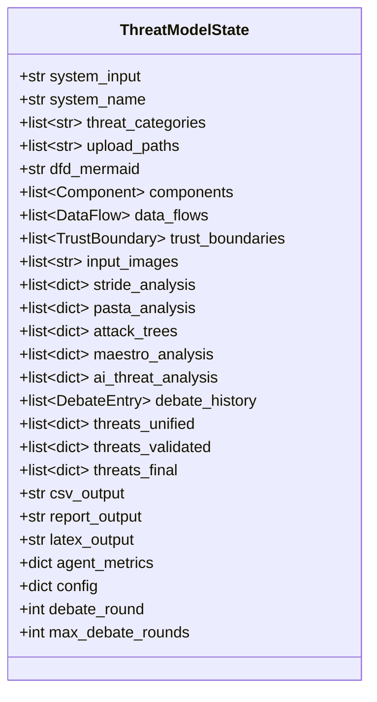
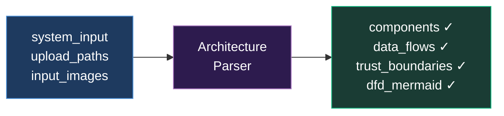
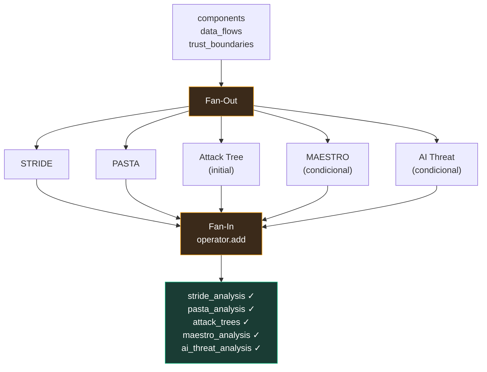
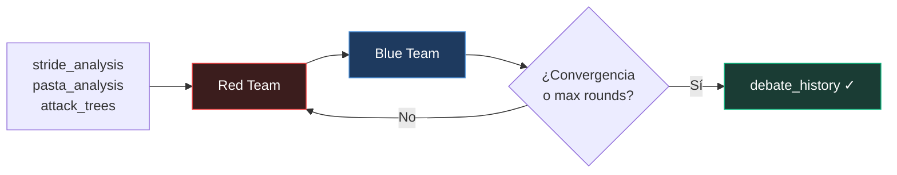
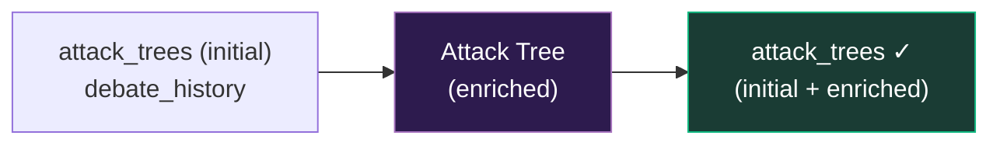
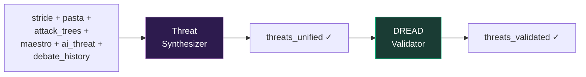
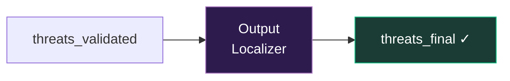
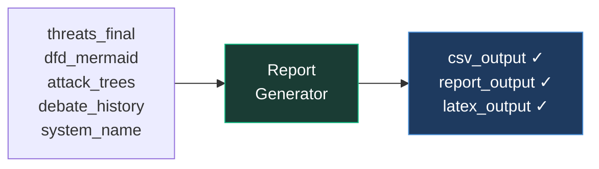
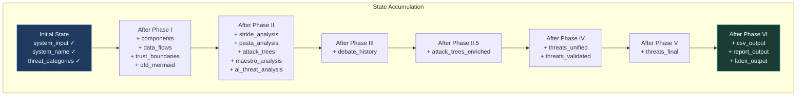
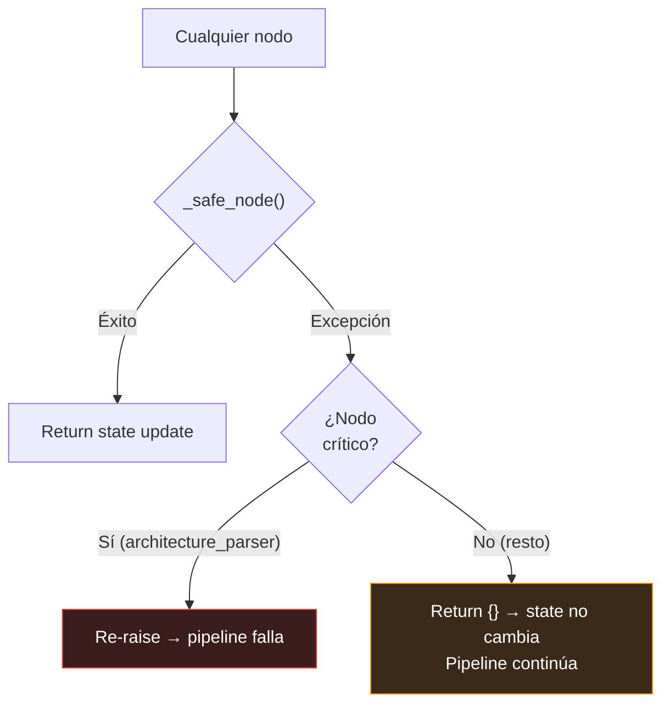

# 10 — Flujo de Datos

> State transitions, qué lee y escribe cada agente, y cómo los datos fluyen por las 6 fases.

---

## `ThreatModelState` — El Bus de Datos

Todos los agentes comparten un único `ThreatModelState` (TypedDict) que funciona como bus de datos. LangGraph gestiona la fusión de updates parciales al state.



### Campos con `Annotated[list, operator.add]`

Los campos de tipo lista usan `Annotated[list, operator.add]` — esto significa que cuando dos nodos escriben al mismo campo, LangGraph **concatena** las listas en lugar de sobrescribir:

```python
# Nodo 1 retorna: {"stride_analysis": [threat_A, threat_B]}
# Nodo 2 retorna: {"pasta_analysis": [threat_C, threat_D]}
# Al fan-in: state tiene ambas listas completas
```

Esto es lo que permite el **fan-out** de analistas en parallel/hybrid — cada analista escribe a su propio campo sin conflictos.

---

## Mapa Lectura/Escritura por Agente

### Tabla Completa

| Agente | Lee | Escribe |
|--------|-----|---------|
| **Architecture Parser** | `system_input`, `upload_paths`, `input_images`, `config` | `components`, `data_flows`, `trust_boundaries`, `dfd_mermaid`, `input_images` |
| **STRIDE Analyst** | `system_input`, `components`, `data_flows`, `trust_boundaries`, `dfd_mermaid` | `stride_analysis` |
| **PASTA Analyst** | `system_input`, `components`, `data_flows` | `pasta_analysis` |
| **Attack Tree Analyst** (initial) | `system_input`, `components`, `data_flows`, `stride_analysis`, `pasta_analysis` | `attack_trees` |
| **MAESTRO Analyst** | `system_input`, `components`, `data_flows` | `maestro_analysis` |
| **AI Threat Analyst** | `system_input`, `components`, `data_flows` | `ai_threat_analysis` |
| **Red Team** | `system_input`, `components`, `stride_analysis`, `pasta_analysis`, `attack_trees`, `debate_history` | `debate_history` |
| **Blue Team** | `system_input`, `components`, `stride_analysis`, `debate_history` | `debate_history` |
| **Attack Tree Analyst** (enriched) | `system_input`, `components`, `attack_trees`, `debate_history` | `attack_trees` (append) |
| **Threat Synthesizer** | `stride_analysis`, `pasta_analysis`, `attack_trees`, `maestro_analysis`, `ai_threat_analysis`, `debate_history`, `components` | `threats_unified` |
| **DREAD Validator** | `threats_unified` OR `threats_validated` | `threats_validated` |
| **Output Localizer** | `threats_validated`, `config` | `threats_final` |
| **Report Generator** | `threats_final`, `dfd_mermaid`, `attack_trees`, `debate_history`, `system_input`, `system_name`, `components` | `csv_output`, `report_output`, `latex_output` |

---

## Flujo por Fase

### Fase I — Análisis de Arquitectura



**Input**: Texto del sistema + archivos subidos + imágenes
**Output**: Componentes estructurados, flujos de datos, trust boundaries, DFD en Mermaid

### Fase II — Analistas en Paralelo/Hybrid/Cascade



**Input**: Arquitectura parseada (componentes, flujos, boundaries)
**Output**: 5 análisis independientes de metodologías diferentes

**Nota**: MAESTRO solo se activa si el input contiene ~30 keywords de AI/ML. AI Threat solo se activa si detecta protocolos agénticos.

### Fase III — Debate Adversarial



**Input**: Los 5 análisis + debate history acumulado
**Output**: `debate_history` con rondas de argumentos Red/Blue

El debate termina cuando:
1. Se alcanza `max_debate_rounds`, o
2. El Blue Team emite señal de convergencia (`CONVERGENCE_REACHED`)

### Fase II.5 — Attack Trees Enriquecidos



**Input**: Attack trees iniciales + insights del debate
**Output**: Attack trees enriquecidos (appended a la lista existente)

### Fase IV — Síntesis y Validación



**Input Synthesizer**: Todos los análisis + debate (15-30K tokens de contexto)
**Output Synthesizer**: Lista unificada con categorías, STRIDE inferido, mitigaciones

**Input DREAD**: `threats_unified` (primera pasada) o `threats_validated` (re-validación)
**Output DREAD**: Scores calibrados con 80% guardrail

### Fase V — Localización



**Input**: `threats_validated` + `config.pipeline.output_language`
**Output**: `threats_final` con campos traducidos al español (si `output_language == "es"`)

**Qué traduce**: description, mitigation, attack_vector
**Qué NO traduce**: id, STRIDE category, DREAD scores, component names, technical terms

### Fase VI — Generación de Reportes



**Input**: Todos los resultados finales
**Output**: Tres formatos de reporte (CSV 16 columnas, Markdown, LaTeX)

---

## Diagrama Completo: Estado a lo Largo del Pipeline



---

## Volumen de Datos por Fase

| Fase | Input (tokens aprox.) | Output (tokens aprox.) | Campos State Nuevos |
|------|----------------------|------------------------|---------------------|
| I | 1-5K (input) | 2-8K (architecture) | 4 campos |
| II | 2-8K × 5 agents | 2-5K × 5 outputs | 5 campos |
| III | 10-25K (all analyses) × rounds | 2-5K × round | 1 campo (append) |
| II.5 | 5-10K (trees + debate) | 2-5K | 1 campo (append) |
| IV | 15-30K (all + debate) | 3-8K (unified) → 3-8K (validated) | 2 campos |
| V | 3-8K (validated) | 3-8K (translated) | 1 campo |
| VI | 5-10K (final + context) | 5-15K (reports) | 3 campos |

**Total acumulado en state final**: ~50-100K tokens de datos estructurados.

---

## Manejo de Errores en el Flujo



| Tipo de Nodo | Comportamiento si falla |
|--------------|------------------------|
| **Crítico** (`architecture_parser`) | Pipeline aborta — sin arquitectura no hay análisis posible |
| **No-crítico** (todos los demás) | Degradación graciosa — ese campo queda vacío, el pipeline continúa |

El Synthesizer puede producir resultados útiles incluso si uno o dos analistas fallaron, porque tiene datos de los otros 3-4 metodologías.

---

*[← 09 — Guía de Uso](09_guia_de_uso.md) · [11 — Mejoras y Roadmap →](11_mejoras_roadmap.md)*
