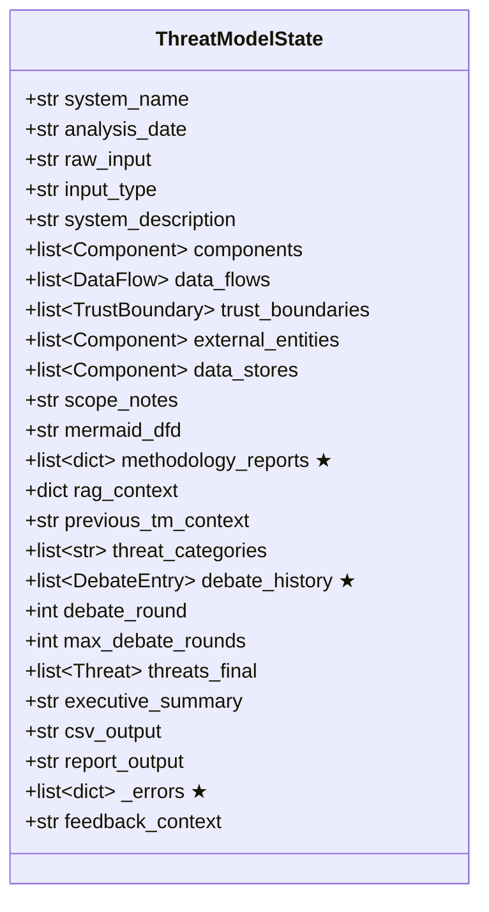
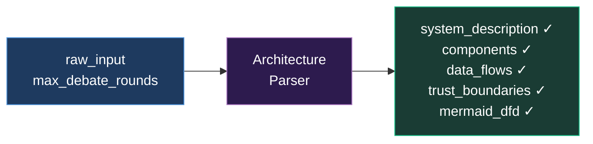
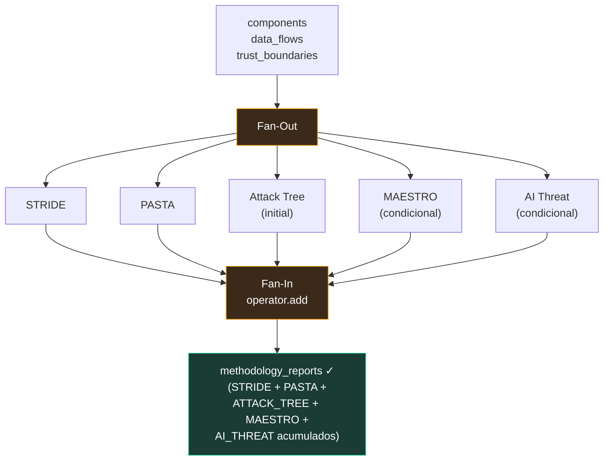
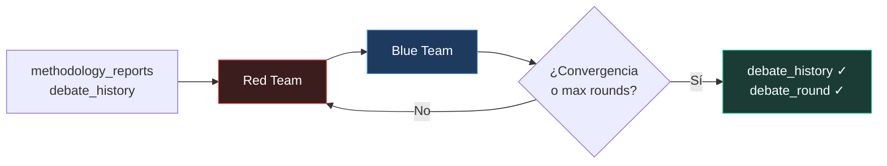
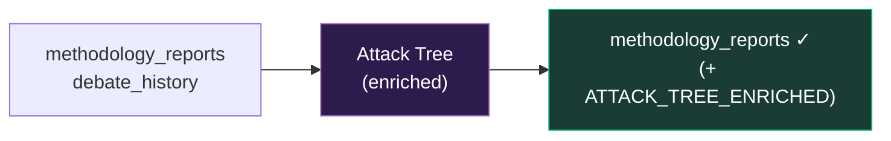
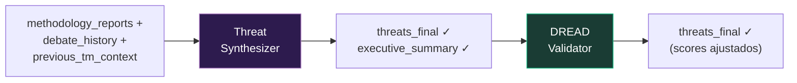
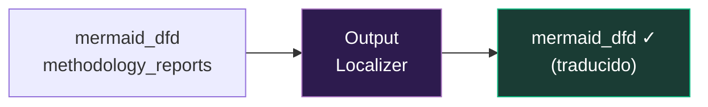
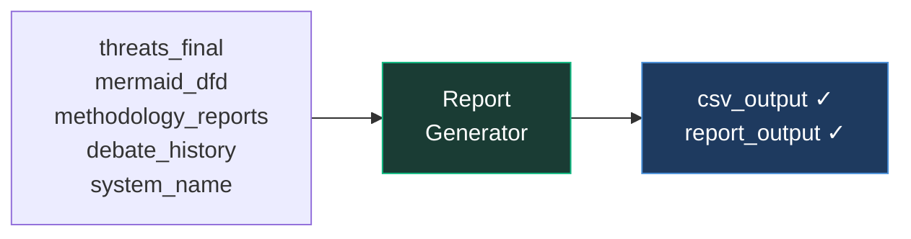
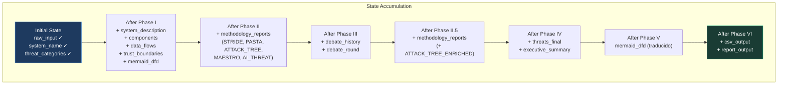
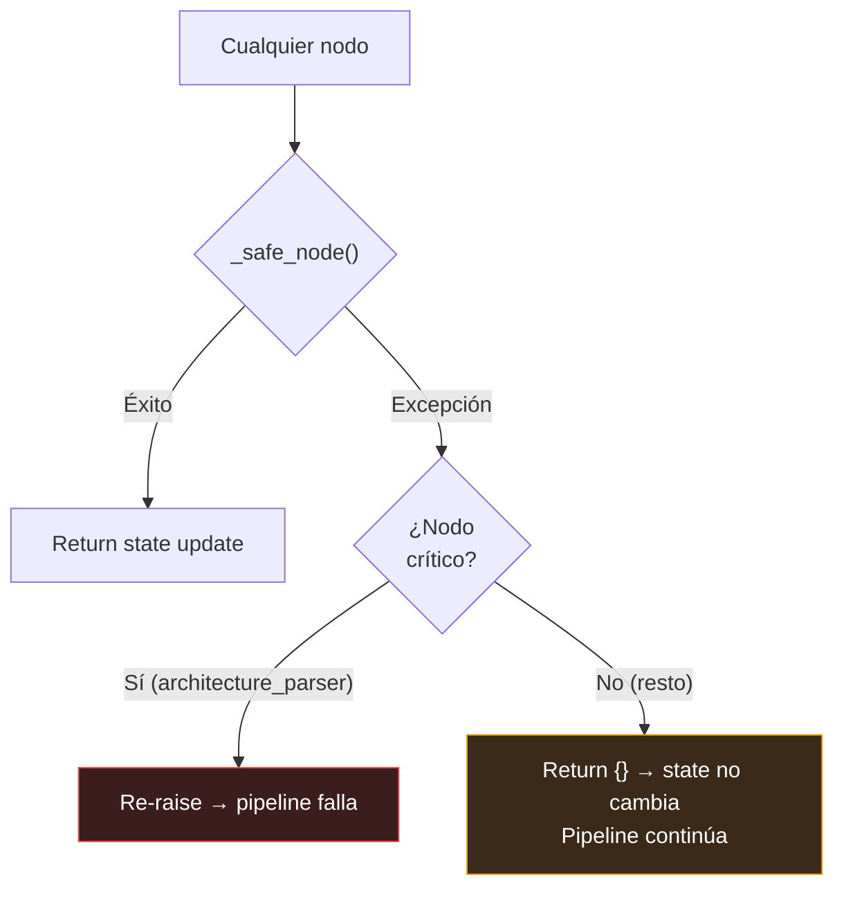

# 10 — Flujo de Datos

> State transitions, qué lee y escribe cada agente, y cómo los datos fluyen por las 6 fases.

---

## `ThreatModelState` — El Bus de Datos

Todos los agentes comparten un único `ThreatModelState` (TypedDict) que funciona como bus de datos. LangGraph gestiona la fusión de updates parciales al state.



> Los campos marcados con ★ usan `Annotated[list, operator.add]` — se acumulan automáticamente.

### Campos con `Annotated[list, operator.add]`

Los campos de tipo lista marcados con ★ usan `Annotated[list, operator.add]` — esto significa que cuando dos nodos escriben al mismo campo, LangGraph **concatena** las listas en lugar de sobrescribir:

```python
# STRIDE retorna: {"methodology_reports": [{"methodology": "STRIDE", "report": ..., "threats_raw": [...]}]}
# PASTA retorna:  {"methodology_reports": [{"methodology": "PASTA",  "report": ..., "threats_raw": [...]}]}
# Al fan-in: state["methodology_reports"] tiene ambos dicts acumulados
```

Esto es lo que permite el **fan-out** de analistas en parallel/hybrid — todos los analistas escriben al mismo campo `methodology_reports` sin conflictos.

---

## Mapa Lectura/Escritura por Agente

### Tabla Completa

| Agente | Lee | Escribe |
|--------|-----|---------|
| **Architecture Parser** | `raw_input`, `max_debate_rounds` | `input_type`, `system_description`, `components`, `data_flows`, `trust_boundaries`, `external_entities`, `data_stores`, `scope_notes`, `mermaid_dfd` |
| **STRIDE Analyst** | `system_description`, `components`, `data_flows`, `trust_boundaries`, `data_stores`, `scope_notes` | `methodology_reports` (append) |
| **PASTA Analyst** | `system_description`, `components`, `data_flows`, `trust_boundaries`, `external_entities`, `scope_notes` | `methodology_reports` (append) |
| **Attack Tree Analyst** (initial) | `system_description`, `components`, `data_flows`, `trust_boundaries`, `data_stores`, `scope_notes` | `methodology_reports` (append) |
| **MAESTRO Analyst** | `system_description`, `components`, `data_flows`, `raw_input`, `scope_notes`, `methodology_reports` | `methodology_reports` (append) |
| **AI Threat Analyst** | `system_description`, `components`, `data_flows`, `raw_input`, `trust_boundaries`, `scope_notes`, `threat_categories` | `methodology_reports` (append) |
| **Red Team** | `raw_input`, `system_description`, `components`, `data_flows`, `trust_boundaries`, `methodology_reports`, `debate_history`, `debate_round` | `debate_history` (append) |
| **Blue Team** | `raw_input`, `system_description`, `components`, `data_flows`, `trust_boundaries`, `methodology_reports`, `debate_history`, `debate_round` | `debate_history` (append), `debate_round` (+1) |
| **Attack Tree Analyst** (enriched) | `system_description`, `components`, `data_flows`, `methodology_reports`, `debate_history` | `methodology_reports` (append) |
| **Threat Synthesizer** | `methodology_reports`, `debate_history`, `system_description`, `components`, `data_flows`, `trust_boundaries`, `previous_tm_context`, `threat_categories` | `threats_final`, `executive_summary`, `report_output` |
| **DREAD Validator** | `threats_final`, `raw_input`, `system_name`, `system_description`, `components`, `data_flows`, `trust_boundaries`, `methodology_reports`, `debate_history`, `threat_categories` | `threats_final` (overwrite) |
| **Output Localizer** | `mermaid_dfd`, `debate_history`, `methodology_reports` | `mermaid_dfd` (overwrite, traducido) |
| **Report Generator** | `threats_final`, `system_name`, `analysis_date`, `mermaid_dfd`, `methodology_reports`, `debate_history`, `system_description`, `threat_categories`, `executive_summary` | `csv_output`, `report_output` |

---

## Flujo por Fase

### Fase I — Análisis de Arquitectura



**Input**: Texto del sistema (`raw_input`)
**Output**: Componentes estructurados, flujos de datos, trust boundaries, DFD en Mermaid

### Fase II — Analistas en Paralelo/Hybrid/Cascade



**Input**: Arquitectura parseada (componentes, flujos, boundaries)
**Output**: `methodology_reports` con hasta 5 entradas acumuladas de metodologías diferentes

**Nota**: MAESTRO solo se activa si el input contiene ~30 keywords de AI/ML. AI Threat solo se activa si detecta protocolos agénticos.

### Fase III — Debate Adversarial



**Input**: Los `methodology_reports` acumulados + debate history
**Output**: `debate_history` con rondas de argumentos Red/Blue, `debate_round` incrementado

El debate termina cuando:
1. Se alcanza `max_debate_rounds`, o
2. El Blue Team emite señal de convergencia (`CONVERGENCE_REACHED`)

### Fase II.5 — Attack Trees Enriquecidos



**Input**: methodology_reports (incluyendo attack trees iniciales) + insights del debate
**Output**: Entry adicional `ATTACK_TREE_ENRICHED` appended a `methodology_reports`

### Fase IV — Síntesis y Validación



**Input Synthesizer**: `methodology_reports` + debate (15-30K tokens de contexto)
**Output Synthesizer**: `threats_final` (lista unificada con categorías, STRIDE inferido, mitigaciones) + `executive_summary`

**Input DREAD**: `threats_final` + contexto del sistema
**Output DREAD**: `threats_final` con scores DREAD calibrados (overwrite, no append)

### Fase V — Localización



**Input**: `mermaid_dfd` + `methodology_reports` + `config.pipeline.output_language`
**Output**: `mermaid_dfd` traducido al español (si `output_language == "es"`)

**Qué traduce**: DFD labels, attack tree reports
**Qué NO traduce**: `threats_final` (ya traducidos por el Synthesizer), `debate_history` (evita duplicación por operator.add)

### Fase VI — Generación de Reportes



**Input**: Todos los resultados finales
**Output**: Dos formatos de reporte (CSV 16 columnas, Markdown). LaTeX se genera bajo demanda via API.

---

## Diagrama Completo: Estado a lo Largo del Pipeline



---

## Volumen de Datos por Fase

| Fase | Input (tokens aprox.) | Output (tokens aprox.) | Campos State Nuevos |
|------|----------------------|------------------------|---------------------|
| I | 1-5K (input) | 2-8K (architecture) | 7 campos |
| II | 2-8K × 5 agents | 2-5K × 5 outputs | 1 campo (`methodology_reports`, acumula 5 entries) |
| III | 10-25K (reports + debate) × rounds | 2-5K × round | 1 campo (`debate_history`, append) |
| II.5 | 5-10K (reports + debate) | 2-5K | 1 campo (`methodology_reports`, +1 entry) |
| IV | 15-30K (all + debate) | 3-8K (threats) | 2 campos (`threats_final`, `executive_summary`) |
| V | 3-8K (DFD + reports) | 3-8K (traducido) | 0 (overwrite `mermaid_dfd`) |
| VI | 5-10K (final + context) | 5-15K (reports) | 2 campos (`csv_output`, `report_output`) |

**Total acumulado en state final**: ~50-100K tokens de datos estructurados.

---

## Manejo de Errores en el Flujo



| Tipo de Nodo | Comportamiento si falla |
|--------------|------------------------|
| **Crítico** (`architecture_parser`) | Pipeline aborta — sin arquitectura no hay análisis posible |
| **No-crítico** (todos los demás) | Degradación graciosa — ese campo queda vacío, el pipeline continúa |

El Synthesizer puede producir resultados útiles incluso si uno o dos analistas fallaron, porque tiene datos de los otros 3-4 metodologías.

---

*[← 09 — Guía de Uso](09_guia_de_uso.md) · [11 — Mejoras y Roadmap →](11_mejoras_roadmap.md)*
