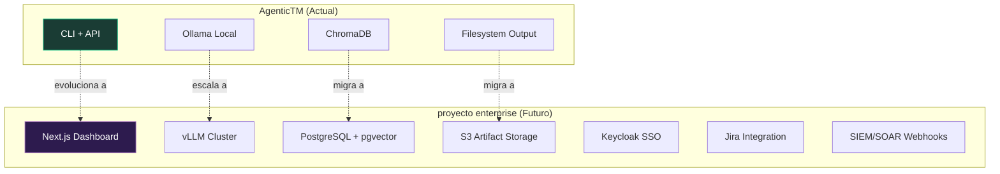

# 11 — Mejoras y Roadmap

> Estado actual, mejoras implementadas, pendientes, y visión proyecto enterprise.

---

## Estado del Proyecto

| Aspecto | Estado |
|---------|--------|
| **Versión actual** | v0.3.2 |
| **Clasificación** | Advanced Prototype / Late Alpha |
| **Pipeline funcional** | ✅ End-to-end operativo |
| **Frontend** | ✅ SPA profesional con 7 tabs |
| **API** | ✅ 28+ routes, SSE, persistencia |
| **RAG** | ✅ Dual (vector + tree), 5 stores |
| **Docker** | ✅ docker-compose con Ollama |
| **CI/CD** | ✅ GitHub Actions (lint + test + docker) |
| **Tests** | ✅ 54 tests (pytest) |

---

## Mejoras Implementadas

### v0.3.1 — Calidad de Output y Frontend Profesional

| ID | Mejora | Impacto |
|----|--------|---------|
| **C1** | PDF Upload Fix — `PyPDFLoader` en lugar de lectura binaria | PDFs procesados correctamente |
| **C2** | `format="json"` — variantes `quick_json`/`deep_json` en LLMFactory | Elimina fallos de parseo JSON |
| **M3** | `max_tool_rounds` 3→5 | Agentes con tools no se quedan cortos |
| **F1** | Tabla de Amenazas profesional (7 categorías, DREAD desglosado) | Output visual de nivel enterprise |
| **F2** | URL Routing con `pushState` | Deep-link support, back/forward funciona |
| **F3** | Renderizado Mermaid v11 (DFD + Attack Trees) | Diagramas interactivos |
| **F4** | Reportes con `marked.js` + auto-render Mermaid embebido | Reportes profesionales |
| **F5** | LaTeX Report Generation | Exportación para documentos formales |
| **F6** | SPA routes en server (no 404 en refresh) | UX robusta |
| **F7** | Print CSS | Exportación a PDF desde el navegador |

### v0.3.2 — Pipeline Inteligente y Debate

| ID | Mejora | Impacto |
|----|--------|---------|
| **M2** | Debate con convergencia — `[CONVERGENCIA]`/`[NUEVOS VECTORES]` | Debates eficientes: 2 rondas si es simple, hasta 10 si es complejo |
| **—** | Hybrid execution mode (`analyst_execution_mode`) | Balance VRAM/calidad, semáforo configurable |
| **—** | 4-tier LLM (quick/deep/stride/vlm) | Cada tarea usa el modelo óptimo |
| **—** | Threat Synthesizer con STRIDE inference + mitigaciones default | Output consistente incluso sin LLM perfecto |
| **—** | Output Localizer condicional | Traducción solo cuando `output_language == "es"` |
| **—** | Report Generator en español | Headers, categorías, prioridades en español |
| **—** | Evidence sources auto-detectadas + evidence_notes editable | Trazabilidad de evidencia |
| **—** | Stale cache fix en frontend (`_clearResultPanels`) | Sin datos residuales de análisis previos |
| **—** | Architecture Parser optimizado (deep→quick JSON) | Más rápido sin perder calidad |

---

## Mejoras Pendientes

### Prioridad Crítica (C)

| ID | Mejora | Esfuerzo | Descripción |
|----|--------|----------|-------------|
| **C3** | Upload Hardening | Bajo | Límites de tamaño, whitelist MIME, cleanup de temporales |

### Prioridad Alta (H)

| ID | Mejora | Esfuerzo | Descripción |
|----|--------|----------|-------------|
| **H1** | Diferenciación real quick vs deep | Bajo | Usar modelo más capaz para deep (actual: ambos qwen3:8b en config) |
| **H2** | Unificación idioma en prompts | Medio | 6 agentes tienen prompts en inglés, 4 en español. Unificar a español |
| **H3** | Prompt Synthesizer para ≥15 amenazas | Medio | Instruir mínimo 15 amenazas con descripciones verbose |
| **H4** | Schema unificado de amenazas (Pydantic) | Alto | Definir `Threat` model usado por todos los agentes |
| **H5** | Validación DREAD con criterios calibrados | Medio | Scoring con criterios explícitos (no solo "1-10") |
| **H6** | RAG con reranking (cross-encoder) | Medio | Mejorar relevancia del context retrieved |
| **H7** | Error handling robusto en pipeline | Medio | Try/except por nodo con graceful degradation |

### Prioridad Media (M)

| ID | Mejora | Esfuerzo | Descripción |
|----|--------|----------|-------------|
| **M1** | Usar `max_validation_iterations` | Medio | Re-validación DREAD si hay scores inconsistentes |
| **M4** | Markdown report con DREAD desglosado | Bajo | Columnas D,R,E,A,D individuales en reporte |
| **M5** | Meta-prompt con TMs previos como few-shot | Medio | Calibrar formato y estilo del Synthesizer |
| **M6** | Endpoint JSON completo `/api/results/{id}/json` | Bajo | Descarga del state completo como JSON |

### Prioridad Baja (L)

| ID | Mejora | Descripción |
|----|--------|-------------|
| **L1** | Dashboard de métricas | Gráficos STRIDE/DREAD distribution, heatmap |
| **L2** | Comparación entre análisis | Diff visual entre TMs del mismo sistema |
| **L3** | Integración Jira | Crear tickets automáticamente desde amenazas |
| **L4** | Multi-idioma en output | Switch español/inglés para reportes |
| **L5** | Rate limiting y auth avanzada | Rate limiting, OAuth2 |
| **L6** | Streaming de resultados parciales | Mostrar amenazas conforme se generan |
| **L7** | Tests E2E | Test de análisis completo con sistema ejemplo |
| **L8** | OpenAPI docs (`/docs`) | Swagger UI con ejemplos |
| **L9** | KB auto-update | CVEs, OWASP Top 10, MITRE ATT&CK automático |
| **L10** | Plugin system | Framework para nuevas metodologías sin modificar builder |

---

## Hallazgos de Evaluaciones

### Evaluación Profunda (doc 13)

**Veredicto**: "Very good advanced prototype"

Hallazgos principales:
- ✅ Fan-out/fan-in de LangGraph: brillante
- ✅ RAG dual (tree + vector): innovador
- ⚠️ Debate estático (fixed rounds) → **Resuelto en v0.3.2**
- ⚠️ Mismo modelo quick = deep → **Parcialmente resuelto** (4 tiers configurados, deep usa MoE)
- ⚠️ Spanglish en output → **Resuelto** (Output Localizer)

### Análisis Objetivo (doc 14)

**Veredicto**: "Fan-out brillante, debate estático, Spanglish degradation"

- El "elephant in the room": mismo modelo para todo → **Resuelto** con 4 tiers
- STRIDE agent con chain-of-thought visible → **Implementado** (DeepSeek-R1 como default)
- Necesidad de convergencia en debate → **Implementado** en v0.3.2

### Evaluación Independiente (doc 15)

**Veredicto**: "Advanced Prototype / Late Alpha"

15 secciones de hallazgos con plan de acción de 5 fases. Puntos clave:
- Fase 1 (bugs): C1 ✅, C2 ✅
- Fase 2 (calidad): H1-H7 parcialmente implementados
- Fase 3 (UX): F1-F7 ✅
- Fase 4 (producción): H4, M1, L7 pendientes
- Fase 5 (enterprise): L1-L10 para proyecto enterprise

---

## Visión proyecto enterprise — Enterprise Future

El RFC "[proyecto enterprise Threat Modeling](../docs/RFC_%20proyecto enterprise%20Threat%20Modeling.md)" describe la evolución enterprise:

| Componente | AgenticTM (Actual) | proyecto enterprise (Futuro) |
|------------|-------------------|-------------------|
| **Frontend** | SPA HTML/JS | Next.js + React |
| **LLM** | Ollama local | vLLM cluster, multi-GPU |
| **Vector DB** | ChromaDB | PostgreSQL + pgvector |
| **Storage** | Filesystem | S3/MinIO |
| **Auth** | API key simple | Keycloak SSO, RBAC |
| **Integrations** | — | Jira, SIEM/SOAR, CI/CD |
| **Multi-tenant** | No | Sí (org → project → analysis) |
| **Compliance** | — | SOC2, ISO 27001 artifact gen |

---

## Próximos Pasos Recomendados

### Sprint 1 — Estabilización

1. **H1**: Diferenciar models (deep = qwen3:30b-a3b realmente diferente)
2. **C3**: Upload hardening (MIME whitelist, tamaños)
3. **H7**: Error handling robusto por nodo (parcialmente implementado con `_safe_node`)

### Sprint 2 — Calidad

1. **H3**: Prompt del sintetizador para ≥15 amenazas
2. **H2**: Unificar idioma de prompts a español
3. **M5**: Few-shot examples con TMs previos

### Sprint 3 — Producción

1. **H4**: Schema Pydantic unificado para amenazas
2. **M1**: Implementar validation iterations
3. **L7**: Tests E2E

---

*[← 10 — Flujo de Datos](10_flujo_de_datos.md) · [12 — Troubleshooting →](12_troubleshooting.md)*
